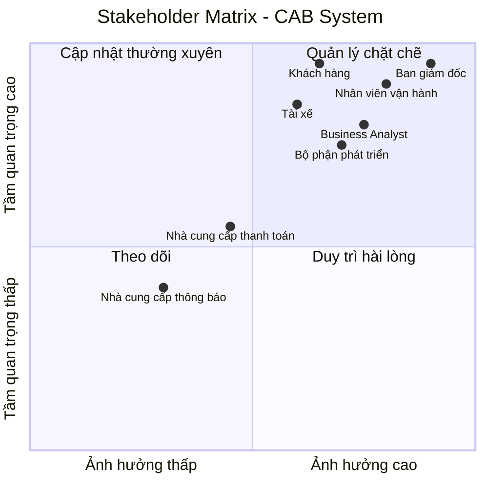
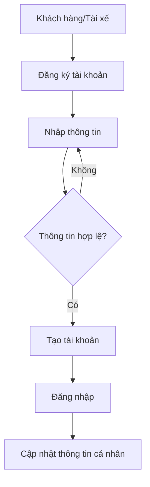
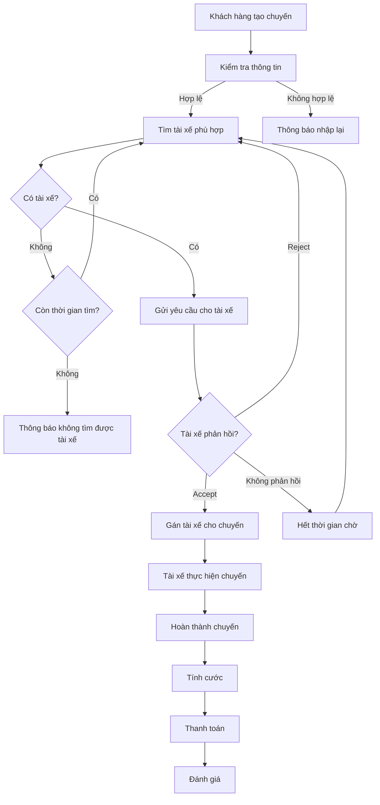
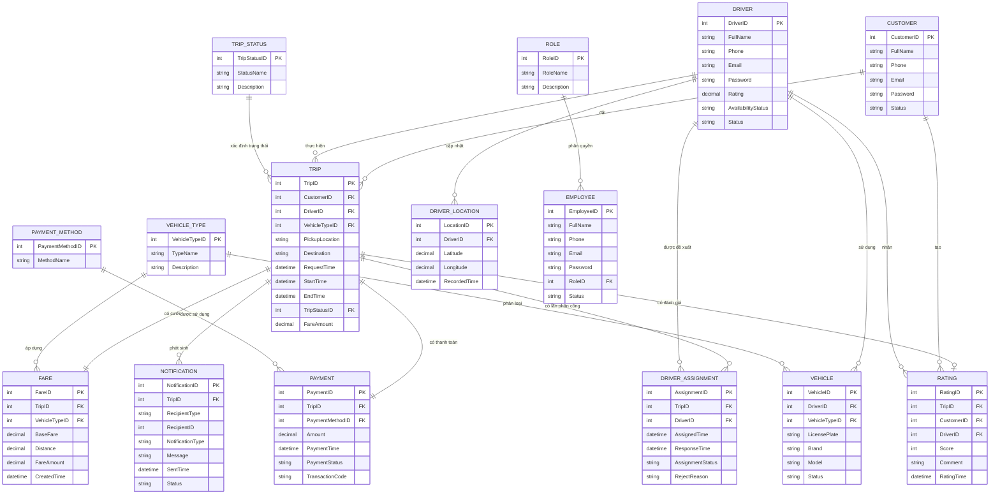

# CAB SYSTEM – PHÂN TÍCH YÊU CẦU

---

# BƯỚC 1: PHÂN TÍCH YÊU CẦU KHÁCH HÀNG

## 1. Business Context – Bối cảnh nghiệp vụ

Công ty ABC là doanh nghiệp cung cấp dịch vụ đặt xe trực tuyến (CAB).
Hiện tại, khách hàng có thể yêu cầu xe thông qua tổng đài hoặc một ứng dụng
đơn giản.

Hệ thống hiện tại đang tồn tại một số hạn chế trong quá trình vận hành,
đặc biệt khi số lượng khách hàng và tài xế tăng lên. Doanh nghiệp mong muốn
xây dựng một nền tảng CAB mới có khả năng hỗ trợ quy trình đặt xe,
quản lý tài xế, thanh toán và vận hành một cách tập trung, đồng thời có
khả năng mở rộng trong tương lai.

---

## 2. Business Problem – Vấn đề nghiệp vụ

### 2.1. Phân công tài xế còn thủ công

Việc phân công tài xế hiện tại chủ yếu được thực hiện thủ công,
gây mất thời gian và khó mở rộng khi số lượng khách hàng và tài xế tăng.

### 2.2. Khách hàng khó theo dõi chuyến đi

Khách hàng khó biết được hệ thống đang tìm tài xế nào, tài xế đã nhận
chuyến hay chưa và trạng thái hiện tại của chuyến đi.

### 2.3. Thông tin thanh toán chưa được quản lý tập trung

Thông tin liên quan đến thanh toán chưa được quản lý tập trung,
gây khó khăn cho việc theo dõi và tra cứu giao dịch.

### 2.4. Khó khăn trong vận hành và mở rộng

Bộ phận vận hành gặp khó khăn khi quản lý số lượng lớn khách hàng,
tài xế và chuyến đi. Hệ thống hiện tại cũng chưa đủ linh hoạt để mở rộng
các chức năng trong tương lai.

### 2.5. Khả năng mở rộng hệ thống còn hạn chế

Doanh nghiệp mong muốn có thể bổ sung các loại dịch vụ mới,
phương thức thanh toán mới và các kênh thông báo mới mà không phải
xây dựng lại toàn bộ hệ thống.

---

# BƯỚC 2: XÁC ĐỊNH VÀ PHÂN TÍCH STAKEHOLDER

## 1. Danh sách Stakeholder

| Tên | Vai trò |
|---|---|
| Ban giám đốc | Định hướng dự án, xác định mục tiêu kinh doanh, phê duyệt các quyết định quan trọng và theo dõi hiệu quả hoạt động |
| Khách hàng | Sử dụng hệ thống để đăng ký, đặt xe, theo dõi chuyến đi, thanh toán và đánh giá tài xế |
| Tài xế | Nhận chuyến, chấp nhận/từ chối chuyến, cập nhật trạng thái chuyến và thực hiện chuyến xe |
| Nhân viên vận hành | Quản lý khách hàng, tài xế, phương tiện và chuyến đi; theo dõi và xử lý các trường hợp phát sinh |
| Bộ phận phát triển hệ thống | Phân tích, thiết kế, xây dựng, kiểm thử và triển khai hệ thống CAB |
| Nhà cung cấp thanh toán | Cung cấp dịch vụ thanh toán điện tử và trả kết quả giao dịch cho hệ thống CAB |
| Nhà cung cấp dịch vụ thông báo | Cung cấp các kênh gửi thông báo như Email, SMS hoặc các kênh khác trong tương lai |

---

## 2. Stakeholder Matrix

Ma trận Stakeholder được xây dựng dựa trên hai tiêu chí:

- **Mức độ ảnh hưởng (Influence):** Khả năng tác động đến quyết định,
  hoạt động và kết quả của dự án.
- **Mức độ quan trọng (Importance):** Mức độ cần thiết của stakeholder
  đối với việc đáp ứng mục tiêu và yêu cầu của hệ thống.

### Phân loại

| Nhóm | Chiến lược |
|---|---|
| Ảnh hưởng cao – Quan trọng cao | Quản lý chặt chẽ, thường xuyên trao đổi và xác nhận |
| Ảnh hưởng cao – Quan trọng thấp | Duy trì sự hài lòng và theo dõi |
| Ảnh hưởng thấp – Quan trọng cao | Thường xuyên cập nhật và thu thập phản hồi |
| Ảnh hưởng thấp – Quan trọng thấp | Theo dõi và cập nhật khi cần |

### Biểu đồ Stakeholder Matrix
## 2. Stakeholder Matrix


# BƯỚC 3: XÁC ĐỊNH BUSINESS GOAL VÀ BUSINESS REQUIREMENT

## 3.1. Xác định Business Goal

Dựa trên Business Problem và các Stakeholder đã xác định, hệ thống CAB
cần đạt được các mục tiêu nghiệp vụ chính:

- Giảm thời gian tìm và phân công tài xế.
- Hỗ trợ khách hàng đặt xe và theo dõi chuyến đi.
- Hỗ trợ nhiều phương thức thanh toán.
- Quản lý tập trung thông tin chuyến đi và giao dịch.
- Hỗ trợ nhân viên vận hành quản lý hệ thống.
- Cung cấp thông báo kịp thời.
- Có khả năng mở rộng trong tương lai.

---

## 3.2. Xác định Business Requirement

### BR01 – Giảm thời gian tìm tài xế

Hệ thống tự động tìm tài xế phù hợp dựa trên vị trí và trạng thái
sẵn sàng của tài xế.

- Ưu tiên tài xế phù hợp và gần khách hàng.
- Nếu tài xế từ chối hoặc không phản hồi, hệ thống tiếp tục tìm tài xế khác.
- Nếu không tìm được tài xế, thông báo cho khách hàng.

### BR02 – Hỗ trợ thanh toán

Hệ thống cho phép khách hàng thanh toán bằng:

- Tiền mặt.
- Thanh toán điện tử thông qua nhà cung cấp thanh toán bên ngoài.

### BR03 – Theo dõi chuyến đi

Khách hàng có thể theo dõi trạng thái chuyến đi:

**Đang tìm tài xế → Đã có tài xế → Tài xế đã đến → Đã đón khách
→ Đang di chuyển → Hoàn thành**

### BR04 – Quản lý thông tin chuyến đi

Hệ thống quản lý tập trung:

- Khách hàng.
- Tài xế.
- Phương tiện.
- Điểm đón, điểm đến.
- Trạng thái chuyến.
- Chi phí.
- Thanh toán.
- Lịch sử chuyến đi.

### BR05 – Hỗ trợ nhân viên vận hành

Nhân viên vận hành có thể:

- Quản lý khách hàng.
- Quản lý tài xế.
- Quản lý phương tiện.
- Theo dõi chuyến đang diễn ra.
- Kiểm tra trạng thái tài xế.
- Xử lý các trường hợp chuyến bị lỗi.
- Tra cứu giao dịch.

### BR06 – Hỗ trợ thông báo

Hệ thống thông báo cho khách hàng và tài xế khi:

- Yêu cầu đặt xe được tiếp nhận.
- Tài xế nhận chuyến.
- Tài xế đến điểm đón.
- Chuyến đi hoàn thành.
- Thanh toán có kết quả.
- Có chuyến mới dành cho tài xế.

### BR07 – Đánh giá tài xế

Sau khi chuyến đi hoàn thành, khách hàng có thể đánh giá tài xế.

### BR08 – Khả năng mở rộng

Hệ thống có khả năng bổ sung:

- Loại dịch vụ mới.
- Phương thức thanh toán mới.
- Nhà cung cấp thông báo mới.
- Các thành phần kỹ thuật mới.

Mà không phải xây dựng lại toàn bộ hệ thống.

---

## 3.3. Business Goal cho phiên bản MVP

Trong thời gian 7 tuần, MVP tập trung vào quy trình nghiệp vụ chính:

**Đặt xe → Tìm tài xế → Nhận chuyến → Thực hiện chuyến
→ Hoàn thành → Tính cước → Thanh toán → Đánh giá**
# BƯỚC 4: XÁC ĐỊNH PHẠM VI YÊU CẦU (SCOPE)

## 4.1. Mục tiêu xác định phạm vi

Xác định rõ các chức năng cần xây dựng trong phiên bản MVP của CAB System
nhằm đảm bảo nhóm tập trung vào các nghiệp vụ cốt lõi, tránh phát triển
những chức năng chưa cần thiết hoặc vượt quá thời gian 7 tuần.

Phạm vi được chia thành:

- **In Scope:** Các chức năng cần triển khai trong MVP.
- **Out of Scope:** Các chức năng chưa triển khai trong MVP nhưng có thể
  xem xét ở các phiên bản sau.

---

## 4.2. Phạm vi chức năng của MVP

| STT | Module | Chức năng chính | Phạm vi MVP |
|---|---|---|---|
| 1 | Quản lý khách hàng | Đăng ký, đăng nhập, cập nhật thông tin cá nhân | In Scope |
| 2 | Quản lý khách hàng | Đặt xe, nhập điểm đón và điểm đến, chọn loại xe | In Scope |
| 3 | Quản lý khách hàng | Theo dõi trạng thái chuyến đi | In Scope |
| 4 | Quản lý khách hàng | Xem lịch sử chuyến đi | In Scope |
| 5 | Quản lý khách hàng | Xem chi phí và trạng thái thanh toán | In Scope |
| 6 | Quản lý khách hàng | Đánh giá tài xế | In Scope |
| 7 | Quản lý tài xế | Đăng nhập và quản lý hồ sơ | In Scope |
| 8 | Quản lý tài xế | Quản lý thông tin phương tiện | In Scope |
| 9 | Quản lý tài xế | Chuyển trạng thái sẵn sàng/không sẵn sàng | In Scope |
| 10 | Quản lý tài xế | Nhận thông báo chuyến mới | In Scope |
| 11 | Quản lý tài xế | Chấp nhận/từ chối chuyến | In Scope |
| 12 | Quản lý tài xế | Cập nhật trạng thái chuyến | In Scope |
| 13 | Quản lý chuyến đi | Tạo và quản lý yêu cầu đặt xe | In Scope |
| 14 | Quản lý chuyến đi | Tìm và phân công tài xế | In Scope |
| 15 | Quản lý chuyến đi | Xử lý trường hợp tài xế từ chối/không phản hồi | In Scope |
| 16 | Quản lý chuyến đi | Cập nhật trạng thái chuyến | In Scope |
| 17 | Tính cước | Tính số tiền khách hàng phải trả | In Scope |
| 18 | Thanh toán | Thanh toán tiền mặt | In Scope |
| 19 | Thanh toán | Thanh toán điện tử mô phỏng | In Scope |
| 20 | Thông báo | Thông báo các sự kiện chính của chuyến đi | In Scope |
| 21 | Quản lý vận hành | Quản lý khách hàng | In Scope |
| 22 | Quản lý vận hành | Quản lý tài xế | In Scope |
| 23 | Quản lý vận hành | Quản lý phương tiện | In Scope |
| 24 | Quản lý vận hành | Theo dõi các chuyến đang diễn ra | In Scope |
| 25 | Quản lý vận hành | Tra cứu lịch sử chuyến đi/giao dịch | In Scope |
| 26 | Quản lý tài khoản | Phân quyền nhân viên vận hành | In Scope |

---

## 4.3. Các chức năng Out of Scope

Các chức năng sau chưa triển khai trong phiên bản MVP do thời gian
xây dựng giới hạn 7 tuần:

| STT | Chức năng | Lý do chưa triển khai |
|---|---|---|
| 1 | Định vị GPS realtime chính xác | Phức tạp, không cần thiết để chứng minh MVP |
| 2 | Thuật toán tối ưu phân công tài xế nâng cao | Có thể phát triển sau khi MVP hoạt động |
| 3 | Tích hợp nhiều nhà cung cấp thanh toán thật | MVP chỉ cần mô phỏng thanh toán điện tử |
| 4 | Tích hợp SMS/Email/Zalo thực tế | MVP có thể sử dụng thông báo trong hệ thống |
| 5 | Báo cáo BI nâng cao | Chưa phải chức năng cốt lõi của MVP |
| 6 | Hệ thống định giá/cước phức tạp | MVP sử dụng quy tắc tính cước cơ bản |
| 7 | Quản lý nhiều loại dịch vụ phức tạp | Chưa cần thiết trong phiên bản demo |
| 8 | Hệ thống xử lý tải lớn thực tế | Chỉ thiết kế theo hướng có khả năng mở rộng |
| 9 | Theo dõi vị trí tài xế theo thời gian thực | Có thể triển khai ở phiên bản sau |
| 10 | Tích hợp nhiều kênh thông báo | Để dành cho phiên bản mở rộng |

---

## 4.4. Xác định các Module của hệ thống

MVP CAB System được chia thành các module chính:

### Module 1 – Quản lý khách hàng

Bao gồm:
- Đăng ký / đăng nhập.
- Quản lý thông tin cá nhân.
- Đặt xe.
- Theo dõi chuyến.
- Xem lịch sử.
- Đánh giá tài xế.

### Module 2 – Quản lý tài xế

Bao gồm:
- Đăng nhập.
- Quản lý hồ sơ.
- Quản lý phương tiện.
- Cập nhật trạng thái hoạt động.
- Nhận và xử lý yêu cầu chuyến.
- Cập nhật trạng thái chuyến.

### Module 3 – Quản lý chuyến đi

Bao gồm:
- Tạo yêu cầu đặt xe.
- Tìm tài xế.
- Phân công tài xế.
- Xử lý tài xế từ chối/không phản hồi.
- Theo dõi trạng thái chuyến.
- Hoàn thành chuyến.

### Module 4 – Tính cước và thanh toán

Bao gồm:
- Tính cước.
- Thanh toán tiền mặt.
- Thanh toán điện tử mô phỏng.
- Cập nhật trạng thái thanh toán.

### Module 5 – Thông báo

Bao gồm:
- Thông báo đặt xe.
- Thông báo tài xế nhận chuyến.
- Thông báo tài xế đến.
- Thông báo hoàn thành chuyến.
- Thông báo kết quả thanh toán.

### Module 6 – Quản lý vận hành

Bao gồm:
- Quản lý khách hàng.
- Quản lý tài xế.
- Quản lý phương tiện.
- Theo dõi chuyến đi.
- Tra cứu giao dịch.
- Xử lý chuyến bị lỗi.

### Module 7 – Quản lý tài khoản và phân quyền

Bao gồm:
- Đăng nhập.
- Phân quyền khách hàng.
- Phân quyền tài xế.
- Phân quyền nhân viên vận hành.

---

## 4.5. MVP Boundary

### In Scope – Tiếp tục triển khai

Các chức năng thuộc luồng nghiệp vụ chính:

**Khách hàng**
→ Đặt xe
→ Hệ thống tìm tài xế
→ Tài xế nhận chuyến
→ Tài xế thực hiện chuyến
→ Hoàn thành
→ Tính cước
→ Thanh toán
→ Đánh giá.

Đồng thời triển khai các chức năng quản trị cơ bản:

**Quản lý khách hàng + Quản lý tài xế + Quản lý phương tiện
+ Quản lý chuyến đi + Tra cứu thanh toán.**

### Out of Scope – Không triển khai trong MVP

Các chức năng nâng cao như:

**GPS realtime + tích hợp thanh toán thật nhiều nhà cung cấp
+ SMS/Email/Zalo thật + thuật toán phân công nâng cao
+ báo cáo BI nâng cao + định giá phức tạp.**

Các chức năng Out of Scope có thể được xem xét và triển khai
ở các phiên bản tiếp theo.

---

## 4.6. Kết luận phạm vi

Phạm vi MVP tập trung vào việc chứng minh quy trình nghiệp vụ cốt lõi
của CAB System và các chức năng quản lý cần thiết.

Mọi chức năng không phục vụ trực tiếp cho quy trình:

**Đặt xe → Tìm tài xế → Nhận chuyến → Thực hiện chuyến
→ Hoàn thành → Thanh toán → Đánh giá**

hoặc không cần thiết cho việc quản lý vận hành cơ bản sẽ được xem xét
đưa ra ngoài phạm vi MVP.
# BƯỚC 5: XÁC ĐỊNH VÀ ĐẶC TẢ BUSINESS REQUIREMENT

Sau khi trao đổi và xác nhận với khách hàng, các yêu cầu nghiệp vụ
được chuẩn hóa thành các Business Requirement (BR). Mỗi Business
Requirement được gán một mã định danh duy nhất để thuận tiện cho việc
theo dõi, thiết kế và kiểm tra trong các bước tiếp theo.

## 5.1. Danh sách Business Requirement

| Mã | Tên Business Requirement | Diễn giải |
|---|---|---|
| BR01 | Đặt chuyến xe | Cho phép khách hàng tạo yêu cầu đặt xe bằng cách cung cấp điểm đón, điểm đến và lựa chọn loại xe phù hợp. |
| BR02 | Tìm và phân công tài xế | Hệ thống tự động tìm tài xế phù hợp dựa trên trạng thái sẵn sàng và vị trí; ưu tiên tài xế phù hợp và gần khách hàng. |
| BR03 | Tiếp nhận và thực hiện chuyến | Cho phép tài xế nhận hoặc từ chối chuyến và cập nhật trạng thái trong quá trình thực hiện chuyến xe. |
| BR04 | Theo dõi trạng thái chuyến | Cho phép khách hàng theo dõi trạng thái chuyến từ lúc tìm tài xế đến khi chuyến hoàn thành. |
| BR05 | Tính cước chuyến xe | Hệ thống xác định số tiền khách hàng phải thanh toán dựa trên loại dịch vụ và thông tin chuyến đi. |
| BR06 | Thanh toán chuyến xe | Cho phép khách hàng thanh toán bằng tiền mặt hoặc thanh toán điện tử. |
| BR07 | Thông báo | Hệ thống gửi thông báo cho khách hàng và tài xế về các sự kiện quan trọng của chuyến đi và thanh toán. |
| BR08 | Đánh giá tài xế | Cho phép khách hàng đánh giá tài xế sau khi chuyến đi hoàn thành. |
| BR09 | Quản lý khách hàng | Cho phép nhân viên vận hành quản lý và tra cứu thông tin khách hàng. |
| BR10 | Quản lý tài xế và phương tiện | Cho phép nhân viên vận hành quản lý thông tin tài xế, phương tiện và trạng thái hoạt động. |
| BR11 | Quản lý chuyến đi | Cho phép nhân viên vận hành theo dõi các chuyến đang diễn ra, tra cứu lịch sử và xử lý các trường hợp phát sinh. |
| BR12 | Quản lý giao dịch | Cho phép nhân viên vận hành tra cứu thông tin thanh toán và trạng thái giao dịch. |
| BR13 | Báo cáo hoạt động | Cung cấp các báo cáo cơ bản về số lượng chuyến, doanh thu, tỷ lệ hoàn thành và tỷ lệ hủy. |
# BƯỚC 6: XÂY DỰNG BUSINESS PROCESS

## 6.1. Danh sách Business Process

Dựa trên các Business Requirement đã xác định, hệ thống CAB được xây dựng
với các Business Process chính sau:

| Mã | Business Process | Mục đích |
|---|---|---|
| BP01 | Đăng ký và quản lý tài khoản | Quản lý tài khoản khách hàng, tài xế |
| BP02 | Đặt chuyến xe | Khách hàng tạo yêu cầu đặt xe |
| BP03 | Tìm và phân công tài xế | Hệ thống tìm và phân công tài xế phù hợp |
| BP04 | Thực hiện chuyến xe | Tài xế nhận, thực hiện và hoàn thành chuyến |
| BP05 | Tính cước và thanh toán | Tính tiền và xử lý thanh toán |
| BP06 | Thông báo | Gửi thông báo cho khách hàng và tài xế |
| BP07 | Đánh giá chuyến đi | Khách hàng đánh giá tài xế sau chuyến |
| BP08 | Quản lý và vận hành hệ thống | Nhân viên quản lý và theo dõi hoạt động |

---

# 6.2. BP01 – ĐĂNG KÝ VÀ QUẢN LÝ TÀI KHOẢN

### Mô tả

Khách hàng và tài xế cần có tài khoản để sử dụng các chức năng yêu cầu
xác thực. Nhân viên vận hành có thể tạo và quản lý tài khoản tài xế.

### Quy trình

Khách hàng/Tài xế  
→ Đăng ký tài khoản  
→ Nhập thông tin  
→ Hệ thống kiểm tra thông tin  
→ Thông tin hợp lệ  
→ Tạo tài khoản  
→ Đăng nhập  
→ Cập nhật thông tin cá nhân khi cần.

Đối với tài xế:

Nhân viên vận hành  
→ Tạo tài khoản tài xế  
→ Nhập thông tin tài xế và phương tiện  
→ Kích hoạt tài khoản.

### Business Process


# BƯỚC 7: PHÂN RÃ BUSINESS REQUIREMENT THÀNH FUNCTIONAL REQUIREMENT

## 7.1. Mục tiêu

Sau khi đã xác định Business Requirement (BR) và Business Process,
tiến hành phân rã từng Business Requirement thành các Functional
Requirement (FR).

Business Requirement mô tả **doanh nghiệp cần đạt được điều gì**,
trong khi Functional Requirement mô tả **hệ thống phải thực hiện
những chức năng gì** để đáp ứng Business Requirement đó.

Nguyên tắc phân rã:

**Business Requirement → Functional Requirement → Chức năng hệ thống**

Chỉ đưa vào Functional Requirement những chức năng được suy ra trực
tiếp từ yêu cầu của khách hàng và phạm vi MVP đã xác định.

---

# 7.2. Phân rã BR01 – Tìm và phân công tài xế

## Business Requirement

### BR01 – Giảm thời gian tìm tài xế

Hệ thống tự động tìm tài xế phù hợp dựa trên vị trí và trạng thái
sẵn sàng của tài xế.

- Ưu tiên tài xế phù hợp và gần khách hàng.
- Nếu tài xế từ chối hoặc không phản hồi, hệ thống tiếp tục tìm
  tài xế khác.
- Nếu không tìm được tài xế, thông báo cho khách hàng.

## Functional Requirement

| Mã | Tên Functional Requirement | Diễn giải |
|---|---|---|
| FR01 | Xác định vị trí khách hàng | Hệ thống xác định vị trí/điểm đón của khách hàng khi tạo chuyến. |
| FR02 | Kiểm tra trạng thái tài xế | Hệ thống kiểm tra trạng thái hoạt động của tài xế để xác định tài xế đang sẵn sàng nhận chuyến. |
| FR03 | Lọc tài xế phù hợp | Hệ thống lọc các tài xế phù hợp với yêu cầu chuyến và loại xe mà khách hàng lựa chọn. |
| FR04 | Xác định tài xế gần khách hàng | Hệ thống xác định các tài xế phù hợp có vị trí gần điểm đón của khách hàng. |
| FR05 | Gửi yêu cầu nhận chuyến | Hệ thống gửi thông báo/yêu cầu chuyến đến tài xế phù hợp. |
| FR06 | Xử lý tài xế chấp nhận chuyến | Khi tài xế chấp nhận, hệ thống gán tài xế vào chuyến và cập nhật trạng thái chuyến. |
| FR07 | Xử lý tài xế từ chối hoặc không phản hồi | Nếu tài xế từ chối hoặc không phản hồi, hệ thống tiếp tục tìm tài xế khác. |
| FR08 | Thông báo không tìm được tài xế | Khi không còn tài xế phù hợp, hệ thống thông báo cho khách hàng rằng không tìm được tài xế. |

### Lưu ý

Yêu cầu khách hàng **không nói tài xế phải có rating cao**, vì vậy
không đưa chức năng:

> "FR – Lọc tài xế có rating cao"

vào phạm vi hiện tại.

Nếu sau này khách hàng xác nhận muốn ưu tiên tài xế có rating cao,
mới bổ sung Functional Requirement tương ứng.

---

# 7.3. Phân rã BR02 – Hỗ trợ thanh toán

## Business Requirement

### BR02 – Hỗ trợ thanh toán

Hệ thống cho phép khách hàng thanh toán bằng tiền mặt hoặc thanh toán
điện tử thông qua nhà cung cấp thanh toán bên ngoài.

## Functional Requirement

| Mã | Tên Functional Requirement | Diễn giải |
|---|---|---|
| FR09 | Hiển thị số tiền thanh toán | Hệ thống hiển thị số tiền khách hàng cần thanh toán sau khi chuyến hoàn thành. |
| FR10 | Chọn phương thức thanh toán | Khách hàng có thể lựa chọn tiền mặt hoặc thanh toán điện tử. |
| FR11 | Xử lý thanh toán tiền mặt | Hệ thống ghi nhận kết quả thanh toán tiền mặt sau khi tài xế xác nhận. |
| FR12 | Gửi yêu cầu thanh toán điện tử | Hệ thống gửi yêu cầu thanh toán đến nhà cung cấp thanh toán bên ngoài. |
| FR13 | Nhận kết quả thanh toán | Hệ thống nhận kết quả giao dịch từ nhà cung cấp thanh toán. |
| FR14 | Cập nhật trạng thái thanh toán | Hệ thống cập nhật trạng thái thành công hoặc thất bại dựa trên kết quả giao dịch. |
| FR15 | Thông báo kết quả thanh toán | Hệ thống thông báo kết quả thanh toán cho khách hàng. |

---

# 7.4. Phân rã BR03 – Theo dõi chuyến đi

## Business Requirement

### BR03 – Theo dõi chuyến đi

Khách hàng có thể theo dõi trạng thái chuyến đi từ khi đặt xe đến khi
hoàn thành.

## Functional Requirement

| Mã | Tên Functional Requirement | Diễn giải |
|---|---|---|
| FR16 | Hiển thị trạng thái tìm tài xế | Hệ thống hiển thị chuyến đang ở trạng thái tìm tài xế. |
| FR17 | Hiển thị thông tin tài xế | Khi có tài xế nhận chuyến, hệ thống hiển thị thông tin tài xế cho khách hàng. |
| FR18 | Cập nhật trạng thái tài xế đến | Hệ thống cập nhật và hiển thị trạng thái khi tài xế đã đến điểm đón. |
| FR19 | Cập nhật trạng thái đã đón khách | Hệ thống cập nhật trạng thái sau khi tài xế đón khách. |
| FR20 | Cập nhật trạng thái đang di chuyển | Hệ thống cập nhật trạng thái khi chuyến bắt đầu di chuyển. |
| FR21 | Cập nhật trạng thái hoàn thành | Hệ thống cập nhật trạng thái khi tài xế hoàn thành chuyến. |

---

# 7.5. Phân rã BR04 – Quản lý thông tin chuyến đi

## Business Requirement

### BR04 – Quản lý thông tin chuyến đi

Hệ thống quản lý tập trung thông tin khách hàng, tài xế, phương tiện,
điểm đón, điểm đến, trạng thái chuyến, chi phí, thanh toán và lịch sử
chuyến đi.

## Functional Requirement

| Mã | Tên Functional Requirement | Diễn giải |
|---|---|---|
| FR22 | Lưu thông tin chuyến | Hệ thống lưu thông tin của từng chuyến xe. |
| FR23 | Quản lý điểm đón và điểm đến | Hệ thống lưu và hiển thị điểm đón, điểm đến của chuyến. |
| FR24 | Quản lý thông tin tài xế | Hệ thống liên kết chuyến với tài xế được phân công. |
| FR25 | Quản lý thông tin phương tiện | Hệ thống lưu thông tin phương tiện thực hiện chuyến. |
| FR26 | Quản lý trạng thái chuyến | Hệ thống lưu và cập nhật trạng thái chuyến theo từng giai đoạn. |
| FR27 | Lưu thông tin chi phí | Hệ thống lưu số tiền phải trả của chuyến. |
| FR28 | Lưu thông tin thanh toán | Hệ thống lưu phương thức và trạng thái thanh toán. |
| FR29 | Xem lịch sử chuyến đi | Khách hàng có thể xem các chuyến đã thực hiện. |

---

# 7.6. Phân rã BR05 – Hỗ trợ nhân viên vận hành

## Business Requirement

### BR05 – Hỗ trợ nhân viên vận hành

Nhân viên vận hành có thể quản lý khách hàng, tài xế, phương tiện,
theo dõi chuyến và tra cứu giao dịch.

## Functional Requirement

| Mã | Tên Functional Requirement | Diễn giải |
|---|---|---|
| FR30 | Xem danh sách khách hàng | Nhân viên vận hành có thể xem danh sách khách hàng. |
| FR31 | Tìm kiếm khách hàng | Nhân viên có thể tìm kiếm khách hàng theo thông tin phù hợp. |
| FR32 | Quản lý tài xế | Nhân viên có thể xem và cập nhật thông tin tài xế. |
| FR33 | Quản lý phương tiện | Nhân viên có thể thêm, xem và cập nhật thông tin phương tiện. |
| FR34 | Theo dõi chuyến đang diễn ra | Nhân viên có thể xem các chuyến đang thực hiện và trạng thái hiện tại. |
| FR35 | Xử lý chuyến bị lỗi | Nhân viên có thể kiểm tra và xử lý các trường hợp chuyến phát sinh lỗi theo quyền được cấp. |
| FR36 | Tra cứu giao dịch | Nhân viên có thể tra cứu lịch sử giao dịch thanh toán. |

---

# 7.7. Phân rã BR06 – Hỗ trợ thông báo

## Business Requirement

### BR06 – Hỗ trợ thông báo

Hệ thống gửi thông báo cho khách hàng và tài xế khi xảy ra các sự kiện
quan trọng trong quá trình đặt và thực hiện chuyến.

## Functional Requirement

| Mã | Tên Functional Requirement | Diễn giải |
|---|---|---|
| FR37 | Thông báo tiếp nhận yêu cầu | Hệ thống thông báo khi yêu cầu đặt xe được tiếp nhận. |
| FR38 | Thông báo tài xế nhận chuyến | Hệ thống thông báo cho khách hàng khi tài xế nhận chuyến. |
| FR39 | Thông báo tài xế đến | Hệ thống thông báo khi tài xế đến điểm đón. |
| FR40 | Thông báo hoàn thành chuyến | Hệ thống thông báo khi chuyến xe hoàn thành. |
| FR41 | Thông báo kết quả thanh toán | Hệ thống thông báo kết quả thanh toán cho khách hàng. |
| FR42 | Thông báo chuyến mới cho tài xế | Hệ thống thông báo cho tài xế khi có chuyến phù hợp. |

---

# 7.8. Phân rã BR07 – Đánh giá tài xế

## Business Requirement

### BR07 – Đánh giá tài xế

Sau khi chuyến đi hoàn thành, khách hàng có thể đánh giá tài xế.

## Functional Requirement

| Mã | Tên Functional Requirement | Diễn giải |
|---|---|---|
| FR43 | Hiển thị chức năng đánh giá | Hệ thống hiển thị chức năng đánh giá sau khi chuyến hoàn thành. |
| FR44 | Chọn mức đánh giá | Khách hàng có thể chọn mức đánh giá cho tài xế. |
| FR45 | Nhập nhận xét | Khách hàng có thể nhập nhận xét về chuyến đi/tài xế. |
| FR46 | Lưu đánh giá | Hệ thống lưu thông tin đánh giá của khách hàng. |

---

# 7.9. Phân rã BR08 – Khả năng mở rộng

## Business Requirement

### BR08 – Khả năng mở rộng

Hệ thống có khả năng bổ sung loại dịch vụ, phương thức thanh toán,
nhà cung cấp thông báo và các thành phần kỹ thuật mới.

## Functional Requirement

BR08 chủ yếu là yêu cầu về kiến trúc và khả năng mở rộng nên không
nhất thiết phải tạo nhiều chức năng giao diện trong MVP.

Trong phạm vi MVP, hệ thống cần được thiết kế để:

| Mã | Tên Functional Requirement | Diễn giải |
|---|---|---|
| FR47 | Hỗ trợ nhiều loại dịch vụ | Thiết kế dữ liệu cho phép bổ sung loại dịch vụ/loại xe mới. |
| FR48 | Hỗ trợ nhiều phương thức thanh toán | Thiết kế hệ thống để có thể bổ sung phương thức thanh toán mới. |
| FR49 | Hỗ trợ nhiều kênh thông báo | Thiết kế thành phần thông báo có khả năng mở rộng thêm kênh mới. |

---

# 7.10. Ma trận Traceability giữa BR và FR

| Business Requirement | Functional Requirement |
|---|---|
| BR01 – Tìm và phân công tài xế | FR01 → FR08 |
| BR02 – Hỗ trợ thanh toán | FR09 → FR15 |
| BR03 – Theo dõi chuyến đi | FR16 → FR21 |
| BR04 – Quản lý thông tin chuyến đi | FR22 → FR29 |
| BR05 – Hỗ trợ nhân viên vận hành | FR30 → FR36 |
| BR06 – Hỗ trợ thông báo | FR37 → FR42 |
| BR07 – Đánh giá tài xế | FR43 → FR46 |
| BR08 – Khả năng mở rộng | FR47 → FR49 |

---

# 7.11. Ví dụ phân rã chi tiết BR01

Business Requirement:

**BR01 – Tìm và phân công tài xế**

Được phân rã thành:

```text
BR01 – Tìm và phân công tài xế
│
├── FR01 – Xác định vị trí khách hàng
│
├── FR02 – Kiểm tra trạng thái tài xế
│
├── FR03 – Lọc tài xế phù hợp
│
├── FR04 – Xác định tài xế gần khách hàng
│
├── FR05 – Gửi yêu cầu nhận chuyến
│
├── FR06 – Xử lý tài xế chấp nhận
│
├── FR07 – Xử lý tài xế từ chối/không phản hồi
│
└── FR08 – Thông báo không tìm được tài xế
```

# BƯỚC 8: XÁC ĐỊNH BUSINESS RULE VÀ EXCEPTION

## 8.1. Business Rules – Quy tắc nghiệp vụ

| Mã | Business Rule | Diễn giải |
|---|---|---|
| BRL01 | Đăng nhập trước khi đặt xe | Khách hàng phải đăng nhập trước khi sử dụng chức năng đặt xe. |
| BRL02 | Thông tin đặt xe bắt buộc | Khách hàng phải cung cấp điểm đón, điểm đến và loại xe. |
| BRL03 | Điểm đón và điểm đến hợp lệ | Điểm đón và điểm đến phải được xác định hợp lệ trước khi tạo chuyến. |
| BRL04 | Chỉ tìm tài xế sẵn sàng | Hệ thống chỉ tìm các tài xế đang ở trạng thái sẵn sàng nhận chuyến. |
| BRL05 | Ưu tiên tài xế phù hợp | Hệ thống ưu tiên tài xế phù hợp với loại xe và vị trí của khách hàng. |
| BRL06 | Giới hạn thời gian phản hồi | Tài xế phải phản hồi yêu cầu chuyến trong thời gian do doanh nghiệp quy định. |
| BRL07 | Không phản hồi thì chuyển tài xế khác | Nếu tài xế không Accept/Reject trong thời gian quy định, hệ thống chuyển sang tài xế khác. |
| BRL08 | Tài xế từ chối thì tìm tài xế khác | Nếu tài xế Reject, hệ thống tiếp tục tìm tài xế phù hợp khác. |
| BRL09 | Một chuyến chỉ có một tài xế | Một chuyến chỉ được gán cho một tài xế tại một thời điểm. |
| BRL10 | Tài xế đang chạy không nhận chuyến mới | Tài xế đang thực hiện chuyến không được nhận thêm chuyến khác. |
| BRL11 | Cập nhật trạng thái theo quy trình | Trạng thái chuyến phải được cập nhật theo đúng trình tự nghiệp vụ. |
| BRL12 | Chỉ tính cước khi hoàn thành | Hệ thống chỉ xác định số tiền thanh toán khi chuyến đã hoàn thành. |
| BRL13 | Hỗ trợ hai phương thức thanh toán | Khách hàng có thể thanh toán bằng tiền mặt hoặc thanh toán điện tử. |
| BRL14 | Chỉ đánh giá sau chuyến | Khách hàng chỉ được đánh giá tài xế sau khi chuyến hoàn thành. |
| BRL15 | Phân quyền chức năng | Người dùng chỉ được sử dụng các chức năng thuộc quyền của mình. |

---

## 8.2. Exception – Các trường hợp ngoại lệ

### EX01 – Thiếu thông tin đặt chuyến

**Điều kiện:** Khách hàng chưa nhập điểm đón, điểm đến hoặc loại xe.

**Xử lý:**
- Không cho tạo chuyến.
- Hiển thị thông tin cần bổ sung.
- Yêu cầu khách hàng nhập lại.

---

### EX02 – Điểm đón/điểm đến không hợp lệ

**Điều kiện:** Địa điểm không xác định được hoặc không thuộc phạm vi
phục vụ.

**Xử lý:**
- Không tạo chuyến.
- Thông báo địa điểm không hợp lệ.
- Yêu cầu khách hàng chọn lại.

---

### EX03 – Không có tài xế sẵn sàng

**Điều kiện:** Không có tài xế phù hợp đang sẵn sàng.

**Xử lý:**
- Tiếp tục tìm trong thời gian cho phép.
- Nếu hết thời gian → thông báo khách hàng.

---

### EX04 – Tìm tài xế quá lâu

**Điều kiện:** Hệ thống đã tìm tài xế nhưng vượt quá thời gian tìm kiếm
do doanh nghiệp quy định.

**Xử lý:**
- Dừng quá trình tìm tài xế.
- Chuyển trạng thái chuyến thành `Không tìm thấy tài xế`.
- Thông báo khách hàng.
- Cho phép khách hàng đặt lại chuyến.

---

### EX05 – Tài xế không phản hồi

**Điều kiện:** Tài xế được gửi yêu cầu nhưng không Accept hoặc Reject
trong thời gian quy định.

**Xử lý:**
- Hết thời gian chờ.
- Hủy yêu cầu gửi cho tài xế đó.
- Chuyển sang tài xế tiếp theo.

---

### EX06 – Tài xế từ chối

**Điều kiện:** Tài xế chọn Reject.

**Xử lý:**
- Ghi nhận tài xế từ chối.
- Không gửi lại yêu cầu cho tài xế đó trong lần tìm hiện tại.
- Tìm tài xế tiếp theo.

---

### EX07 – Tài xế tiếp theo cũng không phản hồi

**Điều kiện:** Tài xế B tiếp tục không phản hồi.

**Xử lý:**
- Hết thời gian chờ B.
- Chuyển sang C.
- Tiếp tục cho đến khi tìm được tài xế hoặc hết thời gian tìm kiếm.

---

### EX08 – Không còn tài xế để tìm

**Điều kiện:** Tất cả tài xế phù hợp đều từ chối hoặc không phản hồi.

**Xử lý:**
- Kết thúc quá trình tìm.
- Cập nhật chuyến `Không tìm thấy tài xế`.
- Thông báo khách hàng.

---

### EX09 – Hai tài xế cùng Accept

**Điều kiện:** Có thể xảy ra trường hợp nhiều tài xế phản hồi gần như
cùng lúc.

**Xử lý:**
- Hệ thống chỉ ghi nhận một tài xế đầu tiên được xác nhận hợp lệ.
- Chuyển các yêu cầu còn lại thành `Đã hết hiệu lực`.
- Không tạo chuyến trùng.

---

### EX10 – Tài xế mất kết nối khi chờ Accept

**Điều kiện:** Tài xế mất kết nối trước khi Accept.

**Xử lý:**
- Chờ đến hết thời gian phản hồi.
- Nếu không nhận được Accept → xem như không phản hồi.
- Chuyển sang tài xế khác.

---

### EX11 – Tài xế mất kết nối sau khi đã Accept

**Điều kiện:** Tài xế đã nhận chuyến nhưng mất kết nối.

**Xử lý:**
- Không tự động hủy ngay.
- Giữ trạng thái chuyến.
- Khi tài xế kết nối lại → đồng bộ trạng thái.
- Nếu vượt quá thời gian cho phép → chuyển sang xử lý ngoại lệ.

---

### EX12 – Khách hàng hủy khi đang tìm tài xế

**Điều kiện:** Khách hàng hủy chuyến trước khi có tài xế nhận.

**Xử lý:**
- Dừng quá trình tìm tài xế.
- Cập nhật chuyến thành `Đã hủy`.
- Không tiếp tục gửi yêu cầu cho tài xế.

---

### EX13 – Khách hàng hủy sau khi tài xế đã nhận

**Điều kiện:** Tài xế đã Accept nhưng khách hàng muốn hủy.

**Xử lý:**
- Kiểm tra chính sách hủy.
- Nếu được phép → hủy chuyến.
- Nếu có phí hủy → tính phí theo chính sách.
- Thông báo kết quả cho khách hàng và tài xế.

---

### EX14 – Thanh toán điện tử thất bại

**Điều kiện:** Nhà cung cấp thanh toán trả về kết quả thất bại.

**Xử lý:**
- Cập nhật trạng thái `Thanh toán thất bại`.
- Thông báo khách hàng.
- Cho phép thanh toán lại.
- Có thể chọn phương thức thanh toán khác nếu chính sách cho phép.

---

### EX15 – Không thể xác định kết quả thanh toán

**Điều kiện:** Hệ thống CAB không nhận được kết quả từ nhà cung cấp
thanh toán.

**Xử lý:**
- Không tự động xác nhận thanh toán thành công.
- Giữ trạng thái `Đang xử lý`.
- Kiểm tra lại giao dịch.
- Thông báo khách hàng khi có kết quả chính thức.

---

## 8.3. Exception trong quá trình thực hiện chuyến

| Mã | Exception | Cách xử lý |
|---|---|---|
| EX16 | Tài xế không đến điểm đón | Ghi nhận sự cố và chuyển cho nhân viên vận hành xử lý. |
| EX17 | Khách hàng không có mặt | Tài xế ghi nhận trạng thái và xử lý theo chính sách hủy. |
| EX18 | Tài xế hủy sau khi nhận chuyến | Cập nhật chuyến và tìm tài xế khác nếu chính sách cho phép. |
| EX19 | Không thể cập nhật trạng thái chuyến | Lưu trạng thái gần nhất và đồng bộ lại khi kết nối được khôi phục. |
| EX20 | Chuyến bị lỗi trong quá trình thực hiện | Ghi nhận lỗi và chuyển cho nhân viên vận hành xử lý. |

---

## 8.4. Exception trong quản lý hệ thống

| Mã | Exception | Cách xử lý |
|---|---|---|
| EX21 | Người dùng truy cập chức năng không có quyền | Từ chối truy cập và thông báo không đủ quyền. |
| EX22 | Tài khoản không tồn tại | Thông báo tài khoản không tồn tại. |
| EX23 | Đăng nhập sai thông tin | Thông báo đăng nhập thất bại và yêu cầu nhập lại. |
| EX24 | Dữ liệu không hợp lệ | Không lưu dữ liệu và yêu cầu nhập lại. |
| EX25 | Lỗi hệ thống | Ghi log lỗi và thông báo người dùng, không làm dừng toàn bộ hệ thống. |

---

## 8.5. Luồng xử lý ngoại lệ quan trọng nhất – Tìm tài xế


# BƯỚC 9: XÂY DỰNG DATA MODEL VÀ ERD

## 9.1. Mục tiêu

Sau khi đã xác định Business Requirement, Business Process, Functional
Requirement và Business Rule, bước tiếp theo là xây dựng Data Model.

Mục tiêu của bước này là:

- Xác định các thực thể (Entity) cần có trong hệ thống.
- Xác định các thuộc tính (Attribute) của từng thực thể.
- Xác định khóa chính (PK) và khóa ngoại (FK).
- Xác định mối quan hệ giữa các thực thể.
- Xác định Cardinality giữa các thực thể.
- Làm cơ sở để xây dựng cơ sở dữ liệu.
- Từ Data Model xây dựng ERD (Entity Relationship Diagram).

---

# 9.2. Xác định các thực thể

Dựa trên Business Requirement và Business Process của hệ thống CAB,
xác định các thực thể chính sau:

| Mã | Entity | Tên thực thể | Diễn giải |
|---|---|---|---|
| E01 | Customer | Khách hàng | Lưu thông tin khách hàng sử dụng dịch vụ |
| E02 | Driver | Tài xế | Lưu thông tin tài xế |
| E03 | Vehicle | Phương tiện | Lưu thông tin phương tiện của tài xế |
| E04 | VehicleType | Loại xe | Lưu loại xe được cung cấp |
| E05 | Trip | Chuyến đi | Lưu thông tin yêu cầu và chuyến xe |
| E06 | TripStatus | Trạng thái chuyến | Quản lý các trạng thái của chuyến |
| E07 | DriverAssignment | Phân công tài xế | Lưu quá trình hệ thống tìm và phân công tài xế |
| E08 | Fare | Cước chuyến xe | Lưu thông tin tính cước |
| E09 | Payment | Thanh toán | Lưu thông tin thanh toán |
| E10 | PaymentMethod | Phương thức thanh toán | Lưu các phương thức thanh toán |
| E11 | Rating | Đánh giá | Lưu đánh giá của khách hàng đối với tài xế |
| E12 | Notification | Thông báo | Lưu các thông báo của hệ thống |
| E13 | DriverLocation | Vị trí tài xế | Lưu thông tin vị trí của tài xế |
| E14 | Employee | Nhân viên vận hành | Lưu thông tin nhân viên vận hành |
| E15 | Role | Vai trò | Lưu thông tin phân quyền |

---

# 9.3. Xác định thuộc tính của các thực thể

## E01 – Customer

Lưu thông tin khách hàng.

| Thuộc tính | Kiểu | Khóa | Diễn giải |
|---|---|---|---|
| CustomerID | INT | PK | Mã khách hàng |
| FullName | VARCHAR | | Họ tên |
| Phone | VARCHAR | | Số điện thoại |
| Email | VARCHAR | | Email |
| Password | VARCHAR | | Mật khẩu |
| Status | VARCHAR | | Trạng thái tài khoản |

---

## E02 – Driver

Lưu thông tin tài xế.

| Thuộc tính | Kiểu | Khóa | Diễn giải |
|---|---|---|---|
| DriverID | INT | PK | Mã tài xế |
| FullName | VARCHAR | | Họ tên |
| Phone | VARCHAR | | Số điện thoại |
| Email | VARCHAR | | Email |
| Password | VARCHAR | | Mật khẩu |
| Rating | DECIMAL | | Điểm đánh giá |
| AvailabilityStatus | VARCHAR | | Trạng thái sẵn sàng |
| Status | VARCHAR | | Trạng thái tài khoản |

---

## E03 – Vehicle

Lưu thông tin phương tiện.

| Thuộc tính | Kiểu | Khóa | Diễn giải |
|---|---|---|---|
| VehicleID | INT | PK | Mã phương tiện |
| DriverID | INT | FK | Mã tài xế |
| VehicleTypeID | INT | FK | Mã loại xe |
| LicensePlate | VARCHAR | | Biển số xe |
| Brand | VARCHAR | | Hãng xe |
| Model | VARCHAR | | Model xe |
| Status | VARCHAR | | Trạng thái phương tiện |

---

## E04 – VehicleType

Lưu thông tin loại xe.

| Thuộc tính | Kiểu | Khóa | Diễn giải |
|---|---|---|---|
| VehicleTypeID | INT | PK | Mã loại xe |
| TypeName | VARCHAR | | Tên loại xe |
| Description | VARCHAR | | Mô tả |

Ví dụ:

- Xe 2 bánh
- Xe 4 bánh

---

## E05 – Trip

Lưu thông tin chuyến xe.

| Thuộc tính | Kiểu | Khóa | Diễn giải |
|---|---|---|---|
| TripID | INT | PK | Mã chuyến |
| CustomerID | INT | FK | Mã khách hàng |
| DriverID | INT | FK | Mã tài xế thực hiện |
| VehicleTypeID | INT | FK | Loại xe |
| PickupLocation | VARCHAR | | Điểm đón |
| Destination | VARCHAR | | Điểm đến |
| RequestTime | DATETIME | | Thời gian yêu cầu |
| StartTime | DATETIME | | Thời gian bắt đầu |
| EndTime | DATETIME | | Thời gian kết thúc |
| TripStatusID | INT | FK | Trạng thái chuyến |
| FareAmount | DECIMAL | | Tổng tiền chuyến |

---

## E06 – TripStatus

Lưu các trạng thái của chuyến.

| Thuộc tính | Kiểu | Khóa | Diễn giải |
|---|---|---|---|
| TripStatusID | INT | PK | Mã trạng thái |
| StatusName | VARCHAR | | Tên trạng thái |
| Description | VARCHAR | | Mô tả |

Các trạng thái chính:

1. Searching – Đang tìm tài xế
2. DriverAccepted – Tài xế đã nhận
3. DriverArrived – Tài xế đã đến
4. PassengerPickedUp – Đã đón khách
5. InProgress – Đang di chuyển
6. Completed – Hoàn thành
7. Cancelled – Đã hủy
8. NoDriver – Không tìm được tài xế

---

## E07 – DriverAssignment

Lưu quá trình tìm và phân công tài xế.

| Thuộc tính | Kiểu | Khóa | Diễn giải |
|---|---|---|---|
| AssignmentID | INT | PK | Mã lần phân công |
| TripID | INT | FK | Mã chuyến |
| DriverID | INT | FK | Mã tài xế được đề xuất |
| AssignedTime | DATETIME | | Thời gian gửi chuyến |
| ResponseTime | DATETIME | | Thời gian tài xế phản hồi |
| AssignmentStatus | VARCHAR | | Trạng thái phân công |
| RejectReason | VARCHAR | | Lý do từ chối |

Ví dụ `AssignmentStatus`:

- Pending
- Accepted
- Rejected
- Timeout

---

## E08 – Fare

Lưu thông tin tính cước.

| Thuộc tính | Kiểu | Khóa | Diễn giải |
|---|---|---|---|
| FareID | INT | PK | Mã cước |
| TripID | INT | FK | Mã chuyến |
| VehicleTypeID | INT | FK | Loại xe |
| BaseFare | DECIMAL | | Giá cơ bản |
| Distance | DECIMAL | | Khoảng cách |
| FareAmount | DECIMAL | | Tổng tiền |
| CreatedTime | DATETIME | | Thời gian tính cước |

---

## E09 – Payment

Lưu thông tin thanh toán.

| Thuộc tính | Kiểu | Khóa | Diễn giải |
|---|---|---|---|
| PaymentID | INT | PK | Mã thanh toán |
| TripID | INT | FK | Mã chuyến |
| PaymentMethodID | INT | FK | Phương thức thanh toán |
| Amount | DECIMAL | | Số tiền |
| PaymentTime | DATETIME | | Thời gian thanh toán |
| PaymentStatus | VARCHAR | | Trạng thái thanh toán |
| TransactionCode | VARCHAR | | Mã giao dịch |

---

## E10 – PaymentMethod

Lưu phương thức thanh toán.

| Thuộc tính | Kiểu | Khóa | Diễn giải |
|---|---|---|---|
| PaymentMethodID | INT | PK | Mã phương thức |
| MethodName | VARCHAR | | Tên phương thức |

Ví dụ:

- Cash – Tiền mặt
- Electronic Payment – Thanh toán điện tử

---

## E11 – Rating

Lưu đánh giá của khách hàng.

| Thuộc tính | Kiểu | Khóa | Diễn giải |
|---|---|---|---|
| RatingID | INT | PK | Mã đánh giá |
| TripID | INT | FK | Mã chuyến |
| CustomerID | INT | FK | Mã khách hàng |
| DriverID | INT | FK | Mã tài xế |
| Score | INT | | Điểm đánh giá |
| Comment | VARCHAR | | Nội dung đánh giá |
| RatingTime | DATETIME | | Thời gian đánh giá |

---

## E12 – Notification

Lưu thông tin thông báo.

| Thuộc tính | Kiểu | Khóa | Diễn giải |
|---|---|---|---|
| NotificationID | INT | PK | Mã thông báo |
| TripID | INT | FK | Mã chuyến liên quan |
| RecipientType | VARCHAR | | Loại người nhận |
| RecipientID | INT | | Mã người nhận |
| NotificationType | VARCHAR | | Loại thông báo |
| Message | VARCHAR | | Nội dung |
| SentTime | DATETIME | | Thời gian gửi |
| Status | VARCHAR | | Trạng thái gửi |

---

## E13 – DriverLocation

Lưu vị trí của tài xế.

| Thuộc tính | Kiểu | Khóa | Diễn giải |
|---|---|---|---|
| LocationID | INT | PK | Mã vị trí |
| DriverID | INT | FK | Mã tài xế |
| Latitude | DECIMAL | | Vĩ độ |
| Longitude | DECIMAL | | Kinh độ |
| RecordedTime | DATETIME | | Thời gian ghi nhận |

> Nếu MVP không triển khai GPS realtime thì thực thể này có thể được xem
> là thành phần mở rộng và chưa cần triển khai đầy đủ.

---

## E14 – Employee

Lưu thông tin nhân viên vận hành.

| Thuộc tính | Kiểu | Khóa | Diễn giải |
|---|---|---|---|
| EmployeeID | INT | PK | Mã nhân viên |
| FullName | VARCHAR | | Họ tên |
| Phone | VARCHAR | | Số điện thoại |
| Email | VARCHAR | | Email |
| Password | VARCHAR | | Mật khẩu |
| RoleID | INT | FK | Mã vai trò |
| Status | VARCHAR | | Trạng thái tài khoản |

---

## E15 – Role

Lưu thông tin vai trò và phân quyền.

| Thuộc tính | Kiểu | Khóa | Diễn giải |
|---|---|---|---|
| RoleID | INT | PK | Mã vai trò |
| RoleName | VARCHAR | | Tên vai trò |
| Description | VARCHAR | | Mô tả |

Ví dụ:

- Operations Staff
- Manager
- Administrator

---

# 9.4. Xác định mối quan hệ giữa các thực thể

| STT | Thực thể 1 | Quan hệ | Thực thể 2 |
|---:|---|---|---|
| 1 | Customer | đặt | Trip |
| 2 | Driver | thực hiện | Trip |
| 3 | Driver | sử dụng | Vehicle |
| 4 | VehicleType | phân loại | Vehicle |
| 5 | TripStatus | xác định trạng thái | Trip |
| 6 | Trip | có các lần phân công | DriverAssignment |
| 7 | Driver | được đề xuất | DriverAssignment |
| 8 | Trip | có | Fare |
| 9 | VehicleType | áp dụng cho | Fare |
| 10 | Trip | có | Payment |
| 11 | PaymentMethod | được sử dụng bởi | Payment |
| 12 | Trip | có | Rating |
| 13 | Customer | tạo | Rating |
| 14 | Driver | nhận | Rating |
| 15 | Trip | phát sinh | Notification |
| 16 | Driver | cập nhật | DriverLocation |
| 17 | Role | phân quyền cho | Employee |

---

# 9.5. Xác định Cardinality

| Quan hệ | Cardinality | Giải thích |
|---|---|---|
| Customer – Trip | 1 : N | Một khách hàng có thể đặt nhiều chuyến |
| Driver – Trip | 1 : N | Một tài xế có thể thực hiện nhiều chuyến |
| Driver – Vehicle | 1 : N | Một tài xế có thể sử dụng nhiều phương tiện |
| VehicleType – Vehicle | 1 : N | Một loại xe có nhiều phương tiện |
| TripStatus – Trip | 1 : N | Một trạng thái có thể được sử dụng cho nhiều chuyến |
| Trip – DriverAssignment | 1 : N | Một chuyến có thể được đề xuất cho nhiều tài xế |
| Driver – DriverAssignment | 1 : N | Một tài xế có thể được đề xuất cho nhiều chuyến |
| Trip – Fare | 1 : 1 | Một chuyến có một thông tin cước |
| VehicleType – Fare | 1 : N | Một loại xe có thể áp dụng cho nhiều bản ghi cước |
| Trip – Payment | 1 : 1 | Một chuyến có một giao dịch thanh toán chính |
| PaymentMethod – Payment | 1 : N | Một phương thức có thể được sử dụng cho nhiều giao dịch |
| Trip – Rating | 1 : 0..1 | Một chuyến có thể chưa được đánh giá hoặc có một đánh giá |
| Customer – Rating | 1 : N | Một khách hàng có thể tạo nhiều đánh giá |
| Driver – Rating | 1 : N | Một tài xế có thể nhận nhiều đánh giá |
| Trip – Notification | 1 : N | Một chuyến có thể phát sinh nhiều thông báo |
| Driver – DriverLocation | 1 : N | Một tài xế có nhiều bản ghi vị trí |
| Role – Employee | 1 : N | Một vai trò có thể được gán cho nhiều nhân viên |

---

# 9.6. Đối chiếu Data Model với Business Requirement

| Business Requirement | Entity đáp ứng |
|---|---|
| BR01 – Giảm thời gian tìm tài xế | Driver, DriverAssignment, DriverLocation |
| BR02 – Hỗ trợ thanh toán | Payment, PaymentMethod |
| BR03 – Theo dõi chuyến đi | Trip, TripStatus |
| BR04 – Quản lý thông tin chuyến | Customer, Driver, Vehicle, Trip, Fare, Payment |
| BR05 – Hỗ trợ nhân viên vận hành | Employee, Role, Customer, Driver, Vehicle, Trip, Payment |
| BR06 – Hỗ trợ thông báo | Notification |
| BR07 – Đánh giá tài xế | Rating |
| BR08 – Khả năng mở rộng | VehicleType, PaymentMethod, Role, Notification |

---

# 9.7. ERD – Entity Relationship Diagram


# BƯỚC 10: XÁC ĐỊNH NON-FUNCTIONAL REQUIREMENT

## 10.1. Khái niệm

**Non-Functional Requirement (NFR)** là các yêu cầu phi chức năng, mô tả
các tiêu chí về chất lượng, hiệu năng, bảo mật, khả năng sử dụng, khả năng
mở rộng và vận hành của hệ thống.

NFR không mô tả hệ thống **làm chức năng gì**, mà mô tả hệ thống phải
**hoạt động như thế nào**.

> Ví dụ: “Khách hàng đặt xe” là Functional Requirement.  
> “Hệ thống phải phản hồi thao tác đặt xe trong thời gian phù hợp” là
> Non-Functional Requirement.

Đối với phiên bản **MVP CAB trong 7 tuần**, NFR được xác định ở mức phù hợp
với mục tiêu demo và phát triển ban đầu. Không đưa vào các yêu cầu kỹ thuật
quá sâu hoặc chưa cần thiết cho nghiệp vụ.

---

## 10.2. Danh sách Non-Functional Requirement

| Mã | Nhóm | Non-Functional Requirement | Mô tả |
|---|---|---|---|
| NFR01 | Performance | Thời gian phản hồi | Các thao tác thông thường như đăng nhập, xem thông tin, tạo yêu cầu đặt xe phải có thời gian phản hồi phù hợp để người dùng sử dụng thuận tiện. |
| NFR02 | Performance | Thời gian xử lý tìm tài xế | Hệ thống phải bắt đầu quá trình tìm tài xế ngay sau khi yêu cầu đặt xe hợp lệ được tạo. |
| NFR03 | Availability | Tính sẵn sàng | Hệ thống phải có khả năng hoạt động ổn định trong thời gian vận hành và demo MVP. |
| NFR04 | Reliability | Độ tin cậy | Hệ thống không được tạo nhiều chuyến trùng khi người dùng gửi lại yêu cầu do lỗi kết nối. |
| NFR05 | Security | Xác thực người dùng | Người dùng phải đăng nhập trước khi sử dụng các chức năng yêu cầu tài khoản. |
| NFR06 | Security | Phân quyền | Người dùng chỉ được truy cập các chức năng phù hợp với vai trò của mình. |
| NFR07 | Security | Bảo vệ thông tin | Thông tin tài khoản, khách hàng, tài xế và giao dịch phải được bảo vệ khỏi truy cập trái phép. |
| NFR08 | Usability | Dễ sử dụng | Giao diện phải đơn giản, rõ ràng để khách hàng có thể thực hiện đặt xe mà không cần hướng dẫn phức tạp. |
| NFR09 | Usability | Thông báo trạng thái | Hệ thống phải hiển thị rõ trạng thái của chuyến đi cho khách hàng và tài xế. |
| NFR10 | Maintainability | Dễ bảo trì | Hệ thống phải được tổ chức rõ ràng để thuận tiện cho việc sửa lỗi và phát triển chức năng mới. |
| NFR11 | Scalability | Khả năng mở rộng | Hệ thống phải có khả năng mở rộng số lượng khách hàng, tài xế và chuyến đi mà không phải thay đổi toàn bộ hệ thống. |
| NFR12 | Scalability | Mở rộng chức năng | Có thể bổ sung loại xe, phương thức thanh toán hoặc kênh thông báo mới mà hạn chế ảnh hưởng đến các chức năng hiện tại. |
| NFR13 | Compatibility | Tương thích | Hệ thống web phải hoạt động trên các trình duyệt phổ biến như Chrome, Edge hoặc Firefox. |
| NFR14 | Data Integrity | Toàn vẹn dữ liệu | Dữ liệu khách hàng, tài xế, chuyến đi và thanh toán phải được lưu trữ nhất quán, tránh dữ liệu sai hoặc thiếu. |
| NFR15 | Auditability | Theo dõi dữ liệu | Các thông tin quan trọng như trạng thái chuyến, thanh toán và giao dịch phải được lưu lại để có thể tra cứu khi cần. |
| NFR16 | Recovery | Xử lý lỗi | Khi xảy ra lỗi trong quá trình xử lý, hệ thống phải thông báo phù hợp và không làm mất dữ liệu đã được ghi nhận hợp lệ. |
| NFR17 | Privacy | Quyền riêng tư | Thông tin cá nhân của khách hàng và tài xế chỉ được cung cấp cho các đối tượng có quyền truy cập. |
| NFR18 | Deployment | Triển khai | Hệ thống phải có khả năng triển khai trên môi trường phát triển/demo và có hướng dẫn cấu hình cơ bản. |

---

## 10.3. Phân loại NFR theo mức độ ưu tiên

Để tránh làm quá phạm vi MVP, các NFR được chia thành ba mức:

| Mức độ | Ý nghĩa |
|---|---|
| **Must Have** | Bắt buộc phải có trong MVP |
| **Should Have** | Nên có nếu còn thời gian |
| **Could Have** | Có thể phát triển ở phiên bản sau |

### Must Have – Bắt buộc

- **NFR05:** Xác thực người dùng.
- **NFR06:** Phân quyền.
- **NFR07:** Bảo vệ thông tin.
- **NFR08:** Dễ sử dụng.
- **NFR09:** Hiển thị trạng thái rõ ràng.
- **NFR14:** Toàn vẹn dữ liệu.
- **NFR16:** Xử lý lỗi.

### Should Have – Nên có

- **NFR01:** Thời gian phản hồi phù hợp.
- **NFR03:** Tính sẵn sàng.
- **NFR04:** Độ tin cậy.
- **NFR10:** Dễ bảo trì.
- **NFR15:** Theo dõi dữ liệu.
- **NFR18:** Khả năng triển khai.

### Could Have – Có thể phát triển sau

- **NFR11:** Khả năng mở rộng lớn.
- **NFR12:** Mở rộng nhiều loại chức năng.
- **NFR13:** Tương thích nhiều trình duyệt ở mức mở rộng.
- **NFR17:** Các cơ chế bảo mật nâng cao.

---

## 10.4. Những yêu cầu KHÔNG đưa vào NFR của MVP

Không nên tự đưa những yêu cầu kỹ thuật quá mức khi khách hàng chưa yêu
cầu hoặc không phục vụ trực tiếp cho MVP.

| Nội dung | Quyết định | Lý do |
|---|---|---|
| Phản hồi dưới 1ms | Không đưa vào | Không thực tế và không cần thiết đối với MVP |
| Bắt buộc sử dụng Microservices | Không đưa vào | Đây là quyết định kiến trúc kỹ thuật, không phải yêu cầu nghiệp vụ |
| Bắt buộc sử dụng Docker/Kubernetes | Không đưa vào | Không cần thiết để chứng minh nghiệp vụ MVP |
| Hỗ trợ hàng triệu người dùng đồng thời | Không đưa vào | Chưa có yêu cầu về quy mô thực tế |
| GPS realtime độ chính xác tuyệt đối | Không đưa vào | Thuộc phạm vi chức năng nâng cao |
| 100% uptime | Không đưa vào | Không phù hợp với phạm vi MVP 7 tuần |
| Phản hồi dưới 0.1 giây cho mọi thao tác | Không đưa vào | Không có cơ sở nghiệp vụ để xác định |
| Kiến trúc Cloud bắt buộc | Không đưa vào | Chưa phải yêu cầu của khách hàng |
| AI tự động phân công tài xế | Không đưa vào | Chưa được xác định là yêu cầu bắt buộc |

---

## 10.5. NFR cần xác nhận với khách hàng

Một số NFR cần được khách hàng xác nhận trước khi chuyển thành tiêu chí
bắt buộc:

| Mã | Nội dung cần xác nhận |
|---|---|
| TBD-NFR01 | Thời gian phản hồi tối đa mà khách hàng chấp nhận là bao lâu? |
| TBD-NFR02 | Số lượng người dùng đồng thời dự kiến là bao nhiêu? |
| TBD-NFR03 | Hệ thống cần hoạt động bao nhiêu giờ/ngày? |
| TBD-NFR04 | Những thông tin nào được xem là dữ liệu nhạy cảm? |
| TBD-NFR05 | Thời gian lưu trữ lịch sử chuyến đi và giao dịch là bao lâu? |
| TBD-NFR06 | Những trình duyệt và thiết bị nào cần được hỗ trợ? |
| TBD-NFR07 | Có yêu cầu sao lưu và khôi phục dữ liệu cụ thể không? |

> **Lưu ý:** Khi khách hàng chưa đưa ra con số cụ thể, không nên tự đặt các
> con số như “< 1ms”, “99.99% uptime”, “1 triệu người dùng” hoặc “100%
> availability”. Có thể ghi **TBD** để xác nhận ở bước tiếp theo.

---

## 10.6. Phạm vi NFR của MVP

Trong thời gian 7 tuần, nhóm tập trung vào các yêu cầu phi chức năng
thực sự cần thiết:

**Bảo mật cơ bản → Phân quyền → Toàn vẹn dữ liệu → Dễ sử dụng
→ Xử lý lỗi → Hiển thị trạng thái → Hiệu năng phù hợp → Dễ bảo trì.**

Các yêu cầu về **kiến trúc Microservices, khả năng chịu tải cực lớn,
GPS realtime chính xác cao, Cloud/Kubernetes, AI phân công nâng cao**
không thuộc phạm vi bắt buộc của MVP.

---

## 10.7. Kết luận

NFR được xây dựng để đảm bảo hệ thống CAB **không chỉ thực hiện đúng
chức năng mà còn hoạt động ổn định, an toàn, dễ sử dụng và có khả năng
phát triển tiếp**.

Phạm vi NFR phải phù hợp với:

**Business Requirement + Business Process + MVP 7 tuần**

Tránh đưa các yêu cầu kỹ thuật không cần thiết làm tăng phạm vi và khối
lượng phát triển của dự án.
# BƯỚC 11: XÁC ĐỊNH VÀ XÂY DỰNG USE CASE

## 11.1. Mục tiêu

Sau khi đã xác định Business Requirement, Business Process,
Functional Requirement, Business Rule, Data Model và Non-functional
Requirement, bước tiếp theo là xác định các Use Case của hệ thống CAB.

Use Case mô tả các chức năng mà Actor có thể thực hiện hoặc tương tác
với hệ thống.

Mỗi Use Case được ký hiệu theo dạng:

- UC01
- UC02
- UC03
- ...

---

## 11.2. Xác định Actor

Dựa trên các Stakeholder và phạm vi MVP đã xác định, hệ thống CAB có
các Actor chính:

| Mã | Actor | Vai trò |
|---|---|---|
| A01 | Khách hàng | Đặt xe, theo dõi chuyến, thanh toán và đánh giá tài xế |
| A02 | Tài xế | Nhận chuyến, chấp nhận/từ chối và thực hiện chuyến |
| A03 | Nhân viên vận hành | Quản lý khách hàng, tài xế, phương tiện và chuyến đi |
| A04 | Nhà cung cấp thanh toán | Xử lý và trả kết quả giao dịch thanh toán điện tử |
| A05 | Hệ thống thông báo | Gửi thông báo đến khách hàng và tài xế |

---

# 11.3. Danh sách Use Case

## Nhóm 1 – Quản lý tài khoản

| Mã | Use Case | Actor |
|---|---|---|
| UC01 | Đăng ký tài khoản | Khách hàng |
| UC02 | Đăng nhập | Khách hàng, Tài xế, Nhân viên vận hành |
| UC03 | Quản lý thông tin cá nhân | Khách hàng, Tài xế |

---

## Nhóm 2 – Đặt và quản lý chuyến

| Mã | Use Case | Actor |
|---|---|---|
| UC04 | Đặt chuyến xe | Khách hàng |
| UC05 | Xác nhận thông tin chuyến | Khách hàng |
| UC06 | Tìm tài xế | Hệ thống |
| UC07 | Phân công tài xế | Hệ thống |
| UC08 | Theo dõi chuyến đi | Khách hàng |
| UC09 | Hủy chuyến | Khách hàng |
| UC10 | Xem lịch sử chuyến đi | Khách hàng |

---

## Nhóm 3 – Tài xế

| Mã | Use Case | Actor |
|---|---|---|
| UC11 | Cập nhật trạng thái sẵn sàng | Tài xế |
| UC12 | Nhận yêu cầu chuyến | Tài xế |
| UC13 | Chấp nhận chuyến | Tài xế |
| UC14 | Từ chối chuyến | Tài xế |
| UC15 | Cập nhật trạng thái chuyến | Tài xế |
| UC16 | Hủy chuyến | Tài xế |
| UC17 | Quản lý phương tiện | Tài xế |

---

## Nhóm 4 – Tính cước và thanh toán

| Mã | Use Case | Actor |
|---|---|---|
| UC18 | Tính cước chuyến xe | Hệ thống |
| UC19 | Thanh toán tiền mặt | Khách hàng, Tài xế |
| UC20 | Thanh toán điện tử | Khách hàng, Nhà cung cấp thanh toán |
| UC21 | Kiểm tra trạng thái thanh toán | Hệ thống |

---

## Nhóm 5 – Đánh giá và thông báo

| Mã | Use Case | Actor |
|---|---|---|
| UC22 | Đánh giá tài xế | Khách hàng |
| UC23 | Gửi thông báo | Hệ thống thông báo |
| UC24 | Nhận thông báo | Khách hàng, Tài xế |

---

## Nhóm 6 – Quản lý vận hành

| Mã | Use Case | Actor |
|---|---|---|
| UC25 | Quản lý khách hàng | Nhân viên vận hành |
| UC26 | Quản lý tài xế | Nhân viên vận hành |
| UC27 | Quản lý phương tiện | Nhân viên vận hành |
| UC28 | Theo dõi chuyến đang diễn ra | Nhân viên vận hành |
| UC29 | Tra cứu lịch sử chuyến | Nhân viên vận hành |
| UC30 | Tra cứu giao dịch | Nhân viên vận hành |
| UC31 | Xử lý chuyến bị lỗi | Nhân viên vận hành |

---

# 11.4. Use Case Diagram

```mermaid
flowchart LR

    KH[Khách hàng]
    TX[Tài xế]
    NV[Nhân viên vận hành]
    PAY[Nhà cung cấp thanh toán]
    NOTI[Hệ thống thông báo]

    subgraph CAB[CAB SYSTEM]

        UC01((UC01<br/>Đăng ký))
        UC02((UC02<br/>Đăng nhập))
        UC03((UC03<br/>Quản lý thông tin))

        UC04((UC04<br/>Đặt chuyến))
        UC05((UC05<br/>Xác nhận thông tin chuyến))
        UC06((UC06<br/>Tìm tài xế))
        UC07((UC07<br/>Phân công tài xế))
        UC08((UC08<br/>Theo dõi chuyến))
        UC09((UC09<br/>Hủy chuyến))
        UC10((UC10<br/>Lịch sử chuyến))

        UC11((UC11<br/>Cập nhật trạng thái sẵn sàng))
        UC12((UC12<br/>Nhận yêu cầu chuyến))
        UC13((UC13<br/>Chấp nhận chuyến))
        UC14((UC14<br/>Từ chối chuyến))
        UC15((UC15<br/>Cập nhật trạng thái chuyến))
        UC16((UC16<br/>Hủy chuyến))
        UC17((UC17<br/>Quản lý phương tiện))

        UC18((UC18<br/>Tính cước))
        UC19((UC19<br/>Thanh toán tiền mặt))
        UC20((UC20<br/>Thanh toán điện tử))
        UC21((UC21<br/>Kiểm tra thanh toán))

        UC22((UC22<br/>Đánh giá tài xế))
        UC23((UC23<br/>Gửi thông báo))
        UC24((UC24<br/>Nhận thông báo))

        UC25((UC25<br/>Quản lý khách hàng))
        UC26((UC26<br/>Quản lý tài xế))
        UC27((UC27<br/>Quản lý phương tiện))
        UC28((UC28<br/>Theo dõi chuyến))
        UC29((UC29<br/>Tra cứu lịch sử))
        UC30((UC30<br/>Tra cứu giao dịch))
        UC31((UC31<br/>Xử lý chuyến lỗi))
    end

    KH --- UC01
    KH --- UC02
    KH --- UC03
    KH --- UC04
    KH --- UC05
    KH --- UC08
    KH --- UC09
    KH --- UC10
    KH --- UC19
    KH --- UC20
    KH --- UC22
    KH --- UC24

    TX --- UC02
    TX --- UC03
    TX --- UC11
    TX --- UC12
    TX --- UC13
    TX --- UC14
    TX --- UC15
    TX --- UC16
    TX --- UC17
    TX --- UC19
    TX --- UC24

    NV --- UC02
    NV --- UC25
    NV --- UC26
    NV --- UC27
    NV --- UC28
    NV --- UC29
    NV --- UC30
    NV --- UC31

    PAY --- UC20
    PAY --- UC21

    NOTI --- UC23
    NOTI --- UC24
```


# BƯỚC 12: ĐẶC TẢ USE CASE

## 12.1. Mục tiêu

Đặc tả Use Case nhằm mô tả chi tiết cách Actor tương tác với hệ thống CAB
để thực hiện một chức năng cụ thể.

Mỗi Use Case được đặc tả gồm:

- Mã Use Case.
- Tên Use Case.
- Actor.
- Mục tiêu.
- Tiền điều kiện.
- Hậu điều kiện.
- Luồng chính.
- Luồng thay thế.
- Luồng ngoại lệ.
- Business Rule liên quan.

---

# 12.2. UC01 – Đăng ký tài khoản

| Thuộc tính | Nội dung |
|---|---|
| Mã | UC01 |
| Tên | Đăng ký tài khoản |
| Actor | Khách hàng |
| Mục tiêu | Tạo tài khoản để sử dụng dịch vụ CAB |
| Tiền điều kiện | Khách hàng chưa có tài khoản |
| Hậu điều kiện | Tài khoản được tạo thành công |

### Luồng chính

1. Khách hàng chọn chức năng **Đăng ký**.
2. Hệ thống hiển thị biểu mẫu đăng ký.
3. Khách hàng nhập họ tên.
4. Khách hàng nhập số điện thoại.
5. Khách hàng nhập email.
6. Khách hàng nhập mật khẩu.
7. Khách hàng gửi thông tin đăng ký.
8. Hệ thống kiểm tra dữ liệu.
9. Hệ thống tạo tài khoản.
10. Hệ thống thông báo đăng ký thành công.

### Luồng thay thế

**ALT01 – Khách hàng nhập lại thông tin**

1. Khách hàng phát hiện thông tin chưa chính xác.
2. Khách hàng chỉnh sửa thông tin.
3. Khách hàng gửi lại biểu mẫu.
4. Hệ thống kiểm tra lại dữ liệu.

### Ngoại lệ

**EX01 – Số điện thoại đã tồn tại**

- Hệ thống thông báo số điện thoại đã được sử dụng.
- Yêu cầu khách hàng sử dụng số điện thoại khác.

**EX02 – Email đã tồn tại**

- Hệ thống thông báo email đã được sử dụng.
- Yêu cầu khách hàng sử dụng email khác.

**EX03 – Dữ liệu không hợp lệ**

- Hệ thống thông báo lỗi.
- Yêu cầu khách hàng nhập lại.

### Business Rule

- BRL01
- BRL15

---

# 12.3. UC02 – Đăng nhập

| Thuộc tính | Nội dung |
|---|---|
| Mã | UC02 |
| Tên | Đăng nhập |
| Actor | Khách hàng, Tài xế, Nhân viên vận hành |
| Mục tiêu | Cho phép người dùng truy cập hệ thống |
| Tiền điều kiện | Người dùng đã có tài khoản |
| Hậu điều kiện | Người dùng đăng nhập thành công |

### Luồng chính

1. Người dùng chọn chức năng **Đăng nhập**.
2. Hệ thống hiển thị màn hình đăng nhập.
3. Người dùng nhập thông tin tài khoản.
4. Người dùng nhập mật khẩu.
5. Hệ thống kiểm tra thông tin.
6. Hệ thống xác thực tài khoản.
7. Hệ thống xác định quyền người dùng.
8. Hệ thống cho phép truy cập.

### Ngoại lệ

**EX01 – Sai thông tin đăng nhập**

- Hệ thống thông báo đăng nhập thất bại.
- Yêu cầu người dùng nhập lại.

**EX02 – Tài khoản bị khóa**

- Hệ thống từ chối đăng nhập.
- Thông báo tài khoản đã bị khóa.

### Business Rule

- BRL15

---

# 12.4. UC04 – Đặt chuyến xe

| Thuộc tính | Nội dung |
|---|---|
| Mã | UC04 |
| Tên | Đặt chuyến xe |
| Actor | Khách hàng |
| Mục tiêu | Tạo yêu cầu đặt một chuyến xe |
| Tiền điều kiện | Khách hàng đã đăng nhập |
| Hậu điều kiện | Chuyến được tạo và chuyển sang trạng thái tìm tài xế |
| Business Requirement | BR01, BR03, BR04 |

### Luồng chính

1. Khách hàng chọn **Đặt chuyến**.
2. Hệ thống hiển thị biểu mẫu đặt chuyến.
3. Khách hàng nhập điểm đón.
4. Khách hàng nhập điểm đến.
5. Khách hàng chọn loại xe.
6. Khách hàng xác nhận thông tin.
7. Hệ thống kiểm tra thông tin.
8. Hệ thống tạo chuyến.
9. Hệ thống lưu thông tin chuyến.
10. Hệ thống chuyển chuyến sang trạng thái `Searching`.
11. Hệ thống bắt đầu tìm tài xế.

### Luồng thay thế

**ALT01 – Khách hàng chỉnh sửa thông tin**

1. Khách hàng chỉnh sửa điểm đón.
2. Khách hàng chỉnh sửa điểm đến hoặc loại xe.
3. Hệ thống cập nhật thông tin.
4. Khách hàng xác nhận lại.

### Ngoại lệ

**EX01 – Thiếu thông tin**

- Hệ thống không tạo chuyến.
- Thông báo thông tin còn thiếu.
- Yêu cầu khách hàng bổ sung.

**EX02 – Điểm đón hoặc điểm đến không hợp lệ**

- Hệ thống thông báo địa điểm không hợp lệ.
- Yêu cầu khách hàng nhập lại.

### Business Rule

- BRL01 – Đăng nhập trước khi đặt xe.
- BRL02 – Thông tin đặt xe bắt buộc.
- BRL03 – Điểm đón và điểm đến hợp lệ.

---

# 12.5. UC05 – Xác nhận thông tin chuyến

| Thuộc tính | Nội dung |
|---|---|
| Mã | UC05 |
| Tên | Xác nhận thông tin chuyến |
| Actor | Khách hàng |
| Mục tiêu | Xác nhận thông tin trước khi tạo chuyến |
| Tiền điều kiện | Khách hàng đã nhập thông tin chuyến |
| Hậu điều kiện | Thông tin chuyến được xác nhận |

### Luồng chính

1. Hệ thống hiển thị điểm đón.
2. Hệ thống hiển thị điểm đến.
3. Hệ thống hiển thị loại xe.
4. Khách hàng kiểm tra thông tin.
5. Khách hàng chọn **Xác nhận**.
6. Hệ thống kiểm tra thông tin.
7. Hệ thống chuyển sang bước tìm tài xế.

### Ngoại lệ

- Thông tin không đầy đủ → yêu cầu khách hàng bổ sung.
- Địa điểm không hợp lệ → yêu cầu chọn lại.

---

# 12.6. UC06 – Tìm tài xế

| Thuộc tính | Nội dung |
|---|---|
| Mã | UC06 |
| Tên | Tìm tài xế |
| Actor | Hệ thống |
| Mục tiêu | Tìm tài xế phù hợp cho chuyến |
| Tiền điều kiện | Chuyến đã được tạo |
| Hậu điều kiện | Tài xế được xác định hoặc không tìm được tài xế |
| Business Requirement | BR01 |

### Luồng chính

1. Hệ thống nhận yêu cầu tìm tài xế.
2. Hệ thống xác định vị trí điểm đón.
3. Hệ thống lấy danh sách tài xế.
4. Hệ thống lọc tài xế theo loại xe.
5. Hệ thống loại bỏ tài xế đang bận.
6. Hệ thống loại bỏ tài xế không sẵn sàng.
7. Hệ thống lựa chọn tài xế phù hợp.
8. Hệ thống gửi yêu cầu chuyến cho tài xế.
9. Hệ thống chờ phản hồi.
10. Tài xế chọn **Accept**.
11. Hệ thống xác nhận tài xế.
12. Hệ thống chuyển chuyến sang trạng thái `DriverAccepted`.

### Luồng thay thế

**ALT01 – Tài xế Reject**

1. Tài xế chọn Reject.
2. Hệ thống ghi nhận kết quả.
3. Hệ thống tìm tài xế khác.

**ALT02 – Tài xế không phản hồi**

1. Hệ thống chờ trong thời gian quy định.
2. Tài xế không phản hồi.
3. Hệ thống hủy yêu cầu đối với tài xế đó.
4. Hệ thống tìm tài xế tiếp theo.

### Ngoại lệ

**EX01 – Không có tài xế phù hợp**

- Hệ thống tiếp tục tìm trong thời gian cho phép.

**EX02 – Hết thời gian tìm tài xế**

- Hệ thống dừng quá trình tìm.
- Chuyển chuyến sang `NoDriver`.
- Thông báo cho khách hàng.

### Business Rule

- BRL04 – Chỉ tìm tài xế sẵn sàng.
- BRL05 – Ưu tiên tài xế phù hợp.
- BRL06 – Giới hạn thời gian phản hồi.
- BRL07 – Không phản hồi thì chuyển tài xế khác.
- BRL08 – Tài xế từ chối thì tìm tài xế khác.

---

# 12.7. UC07 – Phân công tài xế

| Thuộc tính | Nội dung |
|---|---|
| Mã | UC07 |
| Tên | Phân công tài xế |
| Actor | Hệ thống |
| Mục tiêu | Gán tài xế phù hợp cho chuyến |
| Tiền điều kiện | Tài xế đã Accept |
| Hậu điều kiện | Chuyến được gán cho tài xế |

### Luồng chính

1. Hệ thống nhận phản hồi Accept.
2. Hệ thống kiểm tra tài xế.
3. Hệ thống kiểm tra chuyến chưa được gán tài xế.
4. Hệ thống gán tài xế cho chuyến.
5. Hệ thống cập nhật trạng thái tài xế.
6. Hệ thống cập nhật trạng thái chuyến.
7. Hệ thống thông báo cho khách hàng.

### Ngoại lệ

**EX01 – Tài xế không còn sẵn sàng**

- Hệ thống không gán tài xế.
- Tiếp tục tìm tài xế khác.

**EX02 – Hai tài xế cùng Accept**

- Hệ thống chỉ ghi nhận một tài xế hợp lệ đầu tiên.
- Các yêu cầu còn lại chuyển thành hết hiệu lực.

### Business Rule

- BRL09 – Một chuyến chỉ có một tài xế.
- BRL10 – Tài xế đang chạy không nhận chuyến mới.

---

# 12.8. UC08 – Theo dõi chuyến đi

| Thuộc tính | Nội dung |
|---|---|
| Mã | UC08 |
| Tên | Theo dõi chuyến đi |
| Actor | Khách hàng |
| Mục tiêu | Theo dõi trạng thái chuyến |
| Tiền điều kiện | Khách hàng có chuyến đang thực hiện |
| Hậu điều kiện | Khách hàng xem được trạng thái hiện tại |

### Luồng chính

1. Khách hàng mở chuyến đang thực hiện.
2. Hệ thống hiển thị thông tin chuyến.
3. Hệ thống hiển thị tài xế.
4. Hệ thống hiển thị trạng thái chuyến.
5. Hệ thống cập nhật trạng thái khi có thay đổi.
6. Khách hàng theo dõi cho đến khi chuyến hoàn thành.

### Trạng thái chuyến

```text
Searching
    ↓
DriverAccepted
    ↓
DriverArrived
    ↓
PassengerPickedUp
    ↓
InProgress
    ↓
Completed
