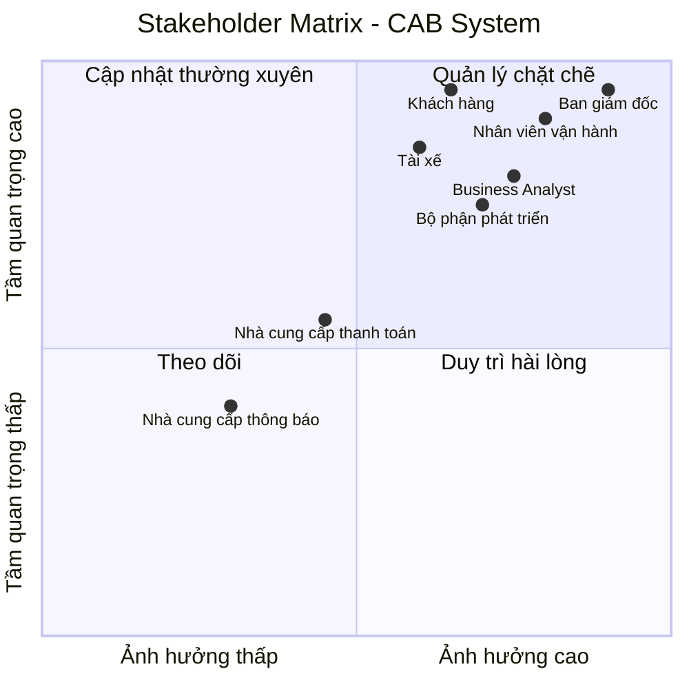
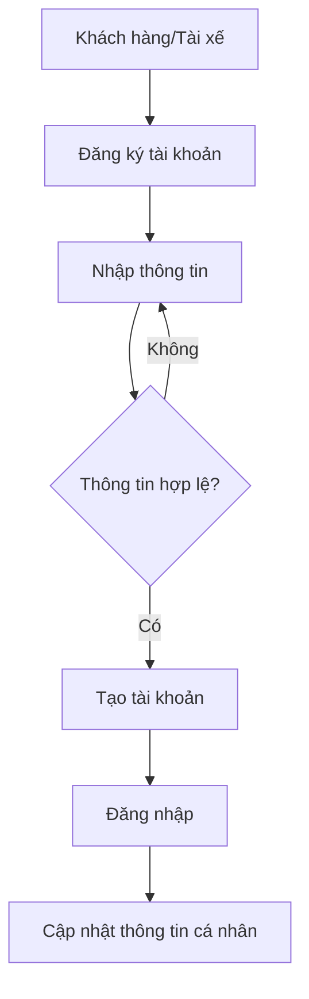

# CAB SYSTEM – PHÂN TÍCH YÊU CẦU

---

# BƯỚC 1: PHÂN TÍCH YÊU CẦU KHÁCH HÀNG

## 1. Business Context – Bối cảnh nghiệp vụ

Công ty ABC là doanh nghiệp cung cấp dịch vụ đặt xe trực tuyến (CAB).
Hiện tại, khách hàng có thể yêu cầu xe thông qua tổng đài hoặc một ứng dụng
đơn giản.

Hệ thống hiện tại đang tồn tại một số hạn chế trong quá trình vận hành,
đặc biệt khi số lượng khách hàng và tài xế tăng lên. Doanh nghiệp mong muốn
xây dựng một nền tảng CAB mới có khả năng hỗ trợ quy trình đặt xe,
quản lý tài xế, thanh toán và vận hành một cách tập trung, đồng thời có
khả năng mở rộng trong tương lai.

---

## 2. Business Problem – Vấn đề nghiệp vụ

### 2.1. Phân công tài xế còn thủ công

Việc phân công tài xế hiện tại chủ yếu được thực hiện thủ công,
gây mất thời gian và khó mở rộng khi số lượng khách hàng và tài xế tăng.

### 2.2. Khách hàng khó theo dõi chuyến đi

Khách hàng khó biết được hệ thống đang tìm tài xế nào, tài xế đã nhận
chuyến hay chưa và trạng thái hiện tại của chuyến đi.

### 2.3. Thông tin thanh toán chưa được quản lý tập trung

Thông tin liên quan đến thanh toán chưa được quản lý tập trung,
gây khó khăn cho việc theo dõi và tra cứu giao dịch.

### 2.4. Khó khăn trong vận hành và mở rộng

Bộ phận vận hành gặp khó khăn khi quản lý số lượng lớn khách hàng,
tài xế và chuyến đi. Hệ thống hiện tại cũng chưa đủ linh hoạt để mở rộng
các chức năng trong tương lai.

### 2.5. Khả năng mở rộng hệ thống còn hạn chế

Doanh nghiệp mong muốn có thể bổ sung các loại dịch vụ mới,
phương thức thanh toán mới và các kênh thông báo mới mà không phải
xây dựng lại toàn bộ hệ thống.

---

# BƯỚC 2: XÁC ĐỊNH VÀ PHÂN TÍCH STAKEHOLDER

## 1. Danh sách Stakeholder

| Tên | Vai trò |
|---|---|
| Ban giám đốc | Định hướng dự án, xác định mục tiêu kinh doanh, phê duyệt các quyết định quan trọng và theo dõi hiệu quả hoạt động |
| Khách hàng | Sử dụng hệ thống để đăng ký, đặt xe, theo dõi chuyến đi, thanh toán và đánh giá tài xế |
| Tài xế | Nhận chuyến, chấp nhận/từ chối chuyến, cập nhật trạng thái chuyến và thực hiện chuyến xe |
| Nhân viên vận hành | Quản lý khách hàng, tài xế, phương tiện và chuyến đi; theo dõi và xử lý các trường hợp phát sinh |
| Bộ phận phát triển hệ thống | Phân tích, thiết kế, xây dựng, kiểm thử và triển khai hệ thống CAB |
| Nhà cung cấp thanh toán | Cung cấp dịch vụ thanh toán điện tử và trả kết quả giao dịch cho hệ thống CAB |
| Nhà cung cấp dịch vụ thông báo | Cung cấp các kênh gửi thông báo như Email, SMS hoặc các kênh khác trong tương lai |

---

## 2. Stakeholder Matrix

Ma trận Stakeholder được xây dựng dựa trên hai tiêu chí:

- **Mức độ ảnh hưởng (Influence):** Khả năng tác động đến quyết định,
  hoạt động và kết quả của dự án.
- **Mức độ quan trọng (Importance):** Mức độ cần thiết của stakeholder
  đối với việc đáp ứng mục tiêu và yêu cầu của hệ thống.

### Phân loại

| Nhóm | Chiến lược |
|---|---|
| Ảnh hưởng cao – Quan trọng cao | Quản lý chặt chẽ, thường xuyên trao đổi và xác nhận |
| Ảnh hưởng cao – Quan trọng thấp | Duy trì sự hài lòng và theo dõi |
| Ảnh hưởng thấp – Quan trọng cao | Thường xuyên cập nhật và thu thập phản hồi |
| Ảnh hưởng thấp – Quan trọng thấp | Theo dõi và cập nhật khi cần |

### Biểu đồ Stakeholder Matrix
## 2. Stakeholder Matrix


# BƯỚC 3: XÁC ĐỊNH BUSINESS GOAL VÀ BUSINESS REQUIREMENT

## 3.1. Xác định Business Goal

Dựa trên Business Problem và các Stakeholder đã xác định, hệ thống CAB
cần đạt được các mục tiêu nghiệp vụ chính:

- Giảm thời gian tìm và phân công tài xế.
- Hỗ trợ khách hàng đặt xe và theo dõi chuyến đi.
- Hỗ trợ nhiều phương thức thanh toán.
- Quản lý tập trung thông tin chuyến đi và giao dịch.
- Hỗ trợ nhân viên vận hành quản lý hệ thống.
- Cung cấp thông báo kịp thời.
- Có khả năng mở rộng trong tương lai.

---

## 3.2. Xác định Business Requirement

### BR01 – Giảm thời gian tìm tài xế

Hệ thống tự động tìm tài xế phù hợp dựa trên vị trí và trạng thái
sẵn sàng của tài xế.

- Ưu tiên tài xế phù hợp và gần khách hàng.
- Nếu tài xế từ chối hoặc không phản hồi, hệ thống tiếp tục tìm tài xế khác.
- Nếu không tìm được tài xế, thông báo cho khách hàng.

### BR02 – Hỗ trợ thanh toán

Hệ thống cho phép khách hàng thanh toán bằng:

- Tiền mặt.
- Thanh toán điện tử thông qua nhà cung cấp thanh toán bên ngoài.

### BR03 – Theo dõi chuyến đi

Khách hàng có thể theo dõi trạng thái chuyến đi:

**Đang tìm tài xế → Đã có tài xế → Tài xế đã đến → Đã đón khách
→ Đang di chuyển → Hoàn thành**

### BR04 – Quản lý thông tin chuyến đi

Hệ thống quản lý tập trung:

- Khách hàng.
- Tài xế.
- Phương tiện.
- Điểm đón, điểm đến.
- Trạng thái chuyến.
- Chi phí.
- Thanh toán.
- Lịch sử chuyến đi.

### BR05 – Hỗ trợ nhân viên vận hành

Nhân viên vận hành có thể:

- Quản lý khách hàng.
- Quản lý tài xế.
- Quản lý phương tiện.
- Theo dõi chuyến đang diễn ra.
- Kiểm tra trạng thái tài xế.
- Xử lý các trường hợp chuyến bị lỗi.
- Tra cứu giao dịch.

### BR06 – Hỗ trợ thông báo

Hệ thống thông báo cho khách hàng và tài xế khi:

- Yêu cầu đặt xe được tiếp nhận.
- Tài xế nhận chuyến.
- Tài xế đến điểm đón.
- Chuyến đi hoàn thành.
- Thanh toán có kết quả.
- Có chuyến mới dành cho tài xế.

### BR07 – Đánh giá tài xế

Sau khi chuyến đi hoàn thành, khách hàng có thể đánh giá tài xế.

### BR08 – Khả năng mở rộng

Hệ thống có khả năng bổ sung:

- Loại dịch vụ mới.
- Phương thức thanh toán mới.
- Nhà cung cấp thông báo mới.
- Các thành phần kỹ thuật mới.

Mà không phải xây dựng lại toàn bộ hệ thống.

---

## 3.3. Business Goal cho phiên bản MVP

Trong thời gian 7 tuần, MVP tập trung vào quy trình nghiệp vụ chính:

**Đặt xe → Tìm tài xế → Nhận chuyến → Thực hiện chuyến
→ Hoàn thành → Tính cước → Thanh toán → Đánh giá**
# BƯỚC 4: XÁC ĐỊNH PHẠM VI YÊU CẦU (SCOPE)

## 4.1. Mục tiêu xác định phạm vi

Xác định rõ các chức năng cần xây dựng trong phiên bản MVP của CAB System
nhằm đảm bảo nhóm tập trung vào các nghiệp vụ cốt lõi, tránh phát triển
những chức năng chưa cần thiết hoặc vượt quá thời gian 7 tuần.

Phạm vi được chia thành:

- **In Scope:** Các chức năng cần triển khai trong MVP.
- **Out of Scope:** Các chức năng chưa triển khai trong MVP nhưng có thể
  xem xét ở các phiên bản sau.

---

## 4.2. Phạm vi chức năng của MVP

| STT | Module | Chức năng chính | Phạm vi MVP |
|---|---|---|---|
| 1 | Quản lý khách hàng | Đăng ký, đăng nhập, cập nhật thông tin cá nhân | In Scope |
| 2 | Quản lý khách hàng | Đặt xe, nhập điểm đón và điểm đến, chọn loại xe | In Scope |
| 3 | Quản lý khách hàng | Theo dõi trạng thái chuyến đi | In Scope |
| 4 | Quản lý khách hàng | Xem lịch sử chuyến đi | In Scope |
| 5 | Quản lý khách hàng | Xem chi phí và trạng thái thanh toán | In Scope |
| 6 | Quản lý khách hàng | Đánh giá tài xế | In Scope |
| 7 | Quản lý tài xế | Đăng nhập và quản lý hồ sơ | In Scope |
| 8 | Quản lý tài xế | Quản lý thông tin phương tiện | In Scope |
| 9 | Quản lý tài xế | Chuyển trạng thái sẵn sàng/không sẵn sàng | In Scope |
| 10 | Quản lý tài xế | Nhận thông báo chuyến mới | In Scope |
| 11 | Quản lý tài xế | Chấp nhận/từ chối chuyến | In Scope |
| 12 | Quản lý tài xế | Cập nhật trạng thái chuyến | In Scope |
| 13 | Quản lý chuyến đi | Tạo và quản lý yêu cầu đặt xe | In Scope |
| 14 | Quản lý chuyến đi | Tìm và phân công tài xế | In Scope |
| 15 | Quản lý chuyến đi | Xử lý trường hợp tài xế từ chối/không phản hồi | In Scope |
| 16 | Quản lý chuyến đi | Cập nhật trạng thái chuyến | In Scope |
| 17 | Tính cước | Tính số tiền khách hàng phải trả | In Scope |
| 18 | Thanh toán | Thanh toán tiền mặt | In Scope |
| 19 | Thanh toán | Thanh toán điện tử mô phỏng | In Scope |
| 20 | Thông báo | Thông báo các sự kiện chính của chuyến đi | In Scope |
| 21 | Quản lý vận hành | Quản lý khách hàng | In Scope |
| 22 | Quản lý vận hành | Quản lý tài xế | In Scope |
| 23 | Quản lý vận hành | Quản lý phương tiện | In Scope |
| 24 | Quản lý vận hành | Theo dõi các chuyến đang diễn ra | In Scope |
| 25 | Quản lý vận hành | Tra cứu lịch sử chuyến đi/giao dịch | In Scope |
| 26 | Quản lý tài khoản | Phân quyền nhân viên vận hành | In Scope |

---

## 4.3. Các chức năng Out of Scope

Các chức năng sau chưa triển khai trong phiên bản MVP do thời gian
xây dựng giới hạn 7 tuần:

| STT | Chức năng | Lý do chưa triển khai |
|---|---|---|
| 1 | Định vị GPS realtime chính xác | Phức tạp, không cần thiết để chứng minh MVP |
| 2 | Thuật toán tối ưu phân công tài xế nâng cao | Có thể phát triển sau khi MVP hoạt động |
| 3 | Tích hợp nhiều nhà cung cấp thanh toán thật | MVP chỉ cần mô phỏng thanh toán điện tử |
| 4 | Tích hợp SMS/Email/Zalo thực tế | MVP có thể sử dụng thông báo trong hệ thống |
| 5 | Báo cáo BI nâng cao | Chưa phải chức năng cốt lõi của MVP |
| 6 | Hệ thống định giá/cước phức tạp | MVP sử dụng quy tắc tính cước cơ bản |
| 7 | Quản lý nhiều loại dịch vụ phức tạp | Chưa cần thiết trong phiên bản demo |
| 8 | Hệ thống xử lý tải lớn thực tế | Chỉ thiết kế theo hướng có khả năng mở rộng |
| 9 | Theo dõi vị trí tài xế theo thời gian thực | Có thể triển khai ở phiên bản sau |
| 10 | Tích hợp nhiều kênh thông báo | Để dành cho phiên bản mở rộng |

---

## 4.4. Xác định các Module của hệ thống

MVP CAB System được chia thành các module chính:

### Module 1 – Quản lý khách hàng

Bao gồm:
- Đăng ký / đăng nhập.
- Quản lý thông tin cá nhân.
- Đặt xe.
- Theo dõi chuyến.
- Xem lịch sử.
- Đánh giá tài xế.

### Module 2 – Quản lý tài xế

Bao gồm:
- Đăng nhập.
- Quản lý hồ sơ.
- Quản lý phương tiện.
- Cập nhật trạng thái hoạt động.
- Nhận và xử lý yêu cầu chuyến.
- Cập nhật trạng thái chuyến.

### Module 3 – Quản lý chuyến đi

Bao gồm:
- Tạo yêu cầu đặt xe.
- Tìm tài xế.
- Phân công tài xế.
- Xử lý tài xế từ chối/không phản hồi.
- Theo dõi trạng thái chuyến.
- Hoàn thành chuyến.

### Module 4 – Tính cước và thanh toán

Bao gồm:
- Tính cước.
- Thanh toán tiền mặt.
- Thanh toán điện tử mô phỏng.
- Cập nhật trạng thái thanh toán.

### Module 5 – Thông báo

Bao gồm:
- Thông báo đặt xe.
- Thông báo tài xế nhận chuyến.
- Thông báo tài xế đến.
- Thông báo hoàn thành chuyến.
- Thông báo kết quả thanh toán.

### Module 6 – Quản lý vận hành

Bao gồm:
- Quản lý khách hàng.
- Quản lý tài xế.
- Quản lý phương tiện.
- Theo dõi chuyến đi.
- Tra cứu giao dịch.
- Xử lý chuyến bị lỗi.

### Module 7 – Quản lý tài khoản và phân quyền

Bao gồm:
- Đăng nhập.
- Phân quyền khách hàng.
- Phân quyền tài xế.
- Phân quyền nhân viên vận hành.

---

## 4.5. MVP Boundary

### In Scope – Tiếp tục triển khai

Các chức năng thuộc luồng nghiệp vụ chính:

**Khách hàng**
→ Đặt xe
→ Hệ thống tìm tài xế
→ Tài xế nhận chuyến
→ Tài xế thực hiện chuyến
→ Hoàn thành
→ Tính cước
→ Thanh toán
→ Đánh giá.

Đồng thời triển khai các chức năng quản trị cơ bản:

**Quản lý khách hàng + Quản lý tài xế + Quản lý phương tiện
+ Quản lý chuyến đi + Tra cứu thanh toán.**

### Out of Scope – Không triển khai trong MVP

Các chức năng nâng cao như:

**GPS realtime + tích hợp thanh toán thật nhiều nhà cung cấp
+ SMS/Email/Zalo thật + thuật toán phân công nâng cao
+ báo cáo BI nâng cao + định giá phức tạp.**

Các chức năng Out of Scope có thể được xem xét và triển khai
ở các phiên bản tiếp theo.

---

## 4.6. Kết luận phạm vi

Phạm vi MVP tập trung vào việc chứng minh quy trình nghiệp vụ cốt lõi
của CAB System và các chức năng quản lý cần thiết.

Mọi chức năng không phục vụ trực tiếp cho quy trình:

**Đặt xe → Tìm tài xế → Nhận chuyến → Thực hiện chuyến
→ Hoàn thành → Thanh toán → Đánh giá**

hoặc không cần thiết cho việc quản lý vận hành cơ bản sẽ được xem xét
đưa ra ngoài phạm vi MVP.
# BƯỚC 5: XÁC ĐỊNH VÀ ĐẶC TẢ BUSINESS REQUIREMENT

Sau khi trao đổi và xác nhận với khách hàng, các yêu cầu nghiệp vụ
được chuẩn hóa thành các Business Requirement (BR). Mỗi Business
Requirement được gán một mã định danh duy nhất để thuận tiện cho việc
theo dõi, thiết kế và kiểm tra trong các bước tiếp theo.

## 5.1. Danh sách Business Requirement

| Mã | Tên Business Requirement | Diễn giải |
|---|---|---|
| BR01 | Đặt chuyến xe | Cho phép khách hàng tạo yêu cầu đặt xe bằng cách cung cấp điểm đón, điểm đến và lựa chọn loại xe phù hợp. |
| BR02 | Tìm và phân công tài xế | Hệ thống tự động tìm tài xế phù hợp dựa trên trạng thái sẵn sàng và vị trí; ưu tiên tài xế phù hợp và gần khách hàng. |
| BR03 | Tiếp nhận và thực hiện chuyến | Cho phép tài xế nhận hoặc từ chối chuyến và cập nhật trạng thái trong quá trình thực hiện chuyến xe. |
| BR04 | Theo dõi trạng thái chuyến | Cho phép khách hàng theo dõi trạng thái chuyến từ lúc tìm tài xế đến khi chuyến hoàn thành. |
| BR05 | Tính cước chuyến xe | Hệ thống xác định số tiền khách hàng phải thanh toán dựa trên loại dịch vụ và thông tin chuyến đi. |
| BR06 | Thanh toán chuyến xe | Cho phép khách hàng thanh toán bằng tiền mặt hoặc thanh toán điện tử. |
| BR07 | Thông báo | Hệ thống gửi thông báo cho khách hàng và tài xế về các sự kiện quan trọng của chuyến đi và thanh toán. |
| BR08 | Đánh giá tài xế | Cho phép khách hàng đánh giá tài xế sau khi chuyến đi hoàn thành. |
| BR09 | Quản lý khách hàng | Cho phép nhân viên vận hành quản lý và tra cứu thông tin khách hàng. |
| BR10 | Quản lý tài xế và phương tiện | Cho phép nhân viên vận hành quản lý thông tin tài xế, phương tiện và trạng thái hoạt động. |
| BR11 | Quản lý chuyến đi | Cho phép nhân viên vận hành theo dõi các chuyến đang diễn ra, tra cứu lịch sử và xử lý các trường hợp phát sinh. |
| BR12 | Quản lý giao dịch | Cho phép nhân viên vận hành tra cứu thông tin thanh toán và trạng thái giao dịch. |
| BR13 | Báo cáo hoạt động | Cung cấp các báo cáo cơ bản về số lượng chuyến, doanh thu, tỷ lệ hoàn thành và tỷ lệ hủy. |
# BƯỚC 6: XÂY DỰNG BUSINESS PROCESS

## 6.1. Danh sách Business Process

Dựa trên các Business Requirement đã xác định, hệ thống CAB được xây dựng
với các Business Process chính sau:

| Mã | Business Process | Mục đích |
|---|---|---|
| BP01 | Đăng ký và quản lý tài khoản | Quản lý tài khoản khách hàng, tài xế |
| BP02 | Đặt chuyến xe | Khách hàng tạo yêu cầu đặt xe |
| BP03 | Tìm và phân công tài xế | Hệ thống tìm và phân công tài xế phù hợp |
| BP04 | Thực hiện chuyến xe | Tài xế nhận, thực hiện và hoàn thành chuyến |
| BP05 | Tính cước và thanh toán | Tính tiền và xử lý thanh toán |
| BP06 | Thông báo | Gửi thông báo cho khách hàng và tài xế |
| BP07 | Đánh giá chuyến đi | Khách hàng đánh giá tài xế sau chuyến |
| BP08 | Quản lý và vận hành hệ thống | Nhân viên quản lý và theo dõi hoạt động |

---

# 6.2. BP01 – ĐĂNG KÝ VÀ QUẢN LÝ TÀI KHOẢN

### Mô tả

Khách hàng và tài xế cần có tài khoản để sử dụng các chức năng yêu cầu
xác thực. Nhân viên vận hành có thể tạo và quản lý tài khoản tài xế.

### Quy trình

Khách hàng/Tài xế  
→ Đăng ký tài khoản  
→ Nhập thông tin  
→ Hệ thống kiểm tra thông tin  
→ Thông tin hợp lệ  
→ Tạo tài khoản  
→ Đăng nhập  
→ Cập nhật thông tin cá nhân khi cần.

Đối với tài xế:

Nhân viên vận hành  
→ Tạo tài khoản tài xế  
→ Nhập thông tin tài xế và phương tiện  
→ Kích hoạt tài khoản.

### Business Process


# BƯỚC 7: PHÂN RÃ BUSINESS REQUIREMENT THÀNH FUNCTIONAL REQUIREMENT

## 7.1. Mục tiêu

Sau khi đã xác định Business Requirement (BR) và Business Process,
tiến hành phân rã từng Business Requirement thành các Functional
Requirement (FR).

Business Requirement mô tả **doanh nghiệp cần đạt được điều gì**,
trong khi Functional Requirement mô tả **hệ thống phải thực hiện
những chức năng gì** để đáp ứng Business Requirement đó.

Nguyên tắc phân rã:

**Business Requirement → Functional Requirement → Chức năng hệ thống**

Chỉ đưa vào Functional Requirement những chức năng được suy ra trực
tiếp từ yêu cầu của khách hàng và phạm vi MVP đã xác định.

---

# 7.2. Phân rã BR01 – Tìm và phân công tài xế

## Business Requirement

### BR01 – Giảm thời gian tìm tài xế

Hệ thống tự động tìm tài xế phù hợp dựa trên vị trí và trạng thái
sẵn sàng của tài xế.

- Ưu tiên tài xế phù hợp và gần khách hàng.
- Nếu tài xế từ chối hoặc không phản hồi, hệ thống tiếp tục tìm
  tài xế khác.
- Nếu không tìm được tài xế, thông báo cho khách hàng.

## Functional Requirement

| Mã | Tên Functional Requirement | Diễn giải |
|---|---|---|
| FR01 | Xác định vị trí khách hàng | Hệ thống xác định vị trí/điểm đón của khách hàng khi tạo chuyến. |
| FR02 | Kiểm tra trạng thái tài xế | Hệ thống kiểm tra trạng thái hoạt động của tài xế để xác định tài xế đang sẵn sàng nhận chuyến. |
| FR03 | Lọc tài xế phù hợp | Hệ thống lọc các tài xế phù hợp với yêu cầu chuyến và loại xe mà khách hàng lựa chọn. |
| FR04 | Xác định tài xế gần khách hàng | Hệ thống xác định các tài xế phù hợp có vị trí gần điểm đón của khách hàng. |
| FR05 | Gửi yêu cầu nhận chuyến | Hệ thống gửi thông báo/yêu cầu chuyến đến tài xế phù hợp. |
| FR06 | Xử lý tài xế chấp nhận chuyến | Khi tài xế chấp nhận, hệ thống gán tài xế vào chuyến và cập nhật trạng thái chuyến. |
| FR07 | Xử lý tài xế từ chối hoặc không phản hồi | Nếu tài xế từ chối hoặc không phản hồi, hệ thống tiếp tục tìm tài xế khác. |
| FR08 | Thông báo không tìm được tài xế | Khi không còn tài xế phù hợp, hệ thống thông báo cho khách hàng rằng không tìm được tài xế. |

### Lưu ý

Yêu cầu khách hàng **không nói tài xế phải có rating cao**, vì vậy
không đưa chức năng:

> "FR – Lọc tài xế có rating cao"

vào phạm vi hiện tại.

Nếu sau này khách hàng xác nhận muốn ưu tiên tài xế có rating cao,
mới bổ sung Functional Requirement tương ứng.

---

# 7.3. Phân rã BR02 – Hỗ trợ thanh toán

## Business Requirement

### BR02 – Hỗ trợ thanh toán

Hệ thống cho phép khách hàng thanh toán bằng tiền mặt hoặc thanh toán
điện tử thông qua nhà cung cấp thanh toán bên ngoài.

## Functional Requirement

| Mã | Tên Functional Requirement | Diễn giải |
|---|---|---|
| FR09 | Hiển thị số tiền thanh toán | Hệ thống hiển thị số tiền khách hàng cần thanh toán sau khi chuyến hoàn thành. |
| FR10 | Chọn phương thức thanh toán | Khách hàng có thể lựa chọn tiền mặt hoặc thanh toán điện tử. |
| FR11 | Xử lý thanh toán tiền mặt | Hệ thống ghi nhận kết quả thanh toán tiền mặt sau khi tài xế xác nhận. |
| FR12 | Gửi yêu cầu thanh toán điện tử | Hệ thống gửi yêu cầu thanh toán đến nhà cung cấp thanh toán bên ngoài. |
| FR13 | Nhận kết quả thanh toán | Hệ thống nhận kết quả giao dịch từ nhà cung cấp thanh toán. |
| FR14 | Cập nhật trạng thái thanh toán | Hệ thống cập nhật trạng thái thành công hoặc thất bại dựa trên kết quả giao dịch. |
| FR15 | Thông báo kết quả thanh toán | Hệ thống thông báo kết quả thanh toán cho khách hàng. |

---

# 7.4. Phân rã BR03 – Theo dõi chuyến đi

## Business Requirement

### BR03 – Theo dõi chuyến đi

Khách hàng có thể theo dõi trạng thái chuyến đi từ khi đặt xe đến khi
hoàn thành.

## Functional Requirement

| Mã | Tên Functional Requirement | Diễn giải |
|---|---|---|
| FR16 | Hiển thị trạng thái tìm tài xế | Hệ thống hiển thị chuyến đang ở trạng thái tìm tài xế. |
| FR17 | Hiển thị thông tin tài xế | Khi có tài xế nhận chuyến, hệ thống hiển thị thông tin tài xế cho khách hàng. |
| FR18 | Cập nhật trạng thái tài xế đến | Hệ thống cập nhật và hiển thị trạng thái khi tài xế đã đến điểm đón. |
| FR19 | Cập nhật trạng thái đã đón khách | Hệ thống cập nhật trạng thái sau khi tài xế đón khách. |
| FR20 | Cập nhật trạng thái đang di chuyển | Hệ thống cập nhật trạng thái khi chuyến bắt đầu di chuyển. |
| FR21 | Cập nhật trạng thái hoàn thành | Hệ thống cập nhật trạng thái khi tài xế hoàn thành chuyến. |

---

# 7.5. Phân rã BR04 – Quản lý thông tin chuyến đi

## Business Requirement

### BR04 – Quản lý thông tin chuyến đi

Hệ thống quản lý tập trung thông tin khách hàng, tài xế, phương tiện,
điểm đón, điểm đến, trạng thái chuyến, chi phí, thanh toán và lịch sử
chuyến đi.

## Functional Requirement

| Mã | Tên Functional Requirement | Diễn giải |
|---|---|---|
| FR22 | Lưu thông tin chuyến | Hệ thống lưu thông tin của từng chuyến xe. |
| FR23 | Quản lý điểm đón và điểm đến | Hệ thống lưu và hiển thị điểm đón, điểm đến của chuyến. |
| FR24 | Quản lý thông tin tài xế | Hệ thống liên kết chuyến với tài xế được phân công. |
| FR25 | Quản lý thông tin phương tiện | Hệ thống lưu thông tin phương tiện thực hiện chuyến. |
| FR26 | Quản lý trạng thái chuyến | Hệ thống lưu và cập nhật trạng thái chuyến theo từng giai đoạn. |
| FR27 | Lưu thông tin chi phí | Hệ thống lưu số tiền phải trả của chuyến. |
| FR28 | Lưu thông tin thanh toán | Hệ thống lưu phương thức và trạng thái thanh toán. |
| FR29 | Xem lịch sử chuyến đi | Khách hàng có thể xem các chuyến đã thực hiện. |

---

# 7.6. Phân rã BR05 – Hỗ trợ nhân viên vận hành

## Business Requirement

### BR05 – Hỗ trợ nhân viên vận hành

Nhân viên vận hành có thể quản lý khách hàng, tài xế, phương tiện,
theo dõi chuyến và tra cứu giao dịch.

## Functional Requirement

| Mã | Tên Functional Requirement | Diễn giải |
|---|---|---|
| FR30 | Xem danh sách khách hàng | Nhân viên vận hành có thể xem danh sách khách hàng. |
| FR31 | Tìm kiếm khách hàng | Nhân viên có thể tìm kiếm khách hàng theo thông tin phù hợp. |
| FR32 | Quản lý tài xế | Nhân viên có thể xem và cập nhật thông tin tài xế. |
| FR33 | Quản lý phương tiện | Nhân viên có thể thêm, xem và cập nhật thông tin phương tiện. |
| FR34 | Theo dõi chuyến đang diễn ra | Nhân viên có thể xem các chuyến đang thực hiện và trạng thái hiện tại. |
| FR35 | Xử lý chuyến bị lỗi | Nhân viên có thể kiểm tra và xử lý các trường hợp chuyến phát sinh lỗi theo quyền được cấp. |
| FR36 | Tra cứu giao dịch | Nhân viên có thể tra cứu lịch sử giao dịch thanh toán. |

---

# 7.7. Phân rã BR06 – Hỗ trợ thông báo

## Business Requirement

### BR06 – Hỗ trợ thông báo

Hệ thống gửi thông báo cho khách hàng và tài xế khi xảy ra các sự kiện
quan trọng trong quá trình đặt và thực hiện chuyến.

## Functional Requirement

| Mã | Tên Functional Requirement | Diễn giải |
|---|---|---|
| FR37 | Thông báo tiếp nhận yêu cầu | Hệ thống thông báo khi yêu cầu đặt xe được tiếp nhận. |
| FR38 | Thông báo tài xế nhận chuyến | Hệ thống thông báo cho khách hàng khi tài xế nhận chuyến. |
| FR39 | Thông báo tài xế đến | Hệ thống thông báo khi tài xế đến điểm đón. |
| FR40 | Thông báo hoàn thành chuyến | Hệ thống thông báo khi chuyến xe hoàn thành. |
| FR41 | Thông báo kết quả thanh toán | Hệ thống thông báo kết quả thanh toán cho khách hàng. |
| FR42 | Thông báo chuyến mới cho tài xế | Hệ thống thông báo cho tài xế khi có chuyến phù hợp. |

---

# 7.8. Phân rã BR07 – Đánh giá tài xế

## Business Requirement

### BR07 – Đánh giá tài xế

Sau khi chuyến đi hoàn thành, khách hàng có thể đánh giá tài xế.

## Functional Requirement

| Mã | Tên Functional Requirement | Diễn giải |
|---|---|---|
| FR43 | Hiển thị chức năng đánh giá | Hệ thống hiển thị chức năng đánh giá sau khi chuyến hoàn thành. |
| FR44 | Chọn mức đánh giá | Khách hàng có thể chọn mức đánh giá cho tài xế. |
| FR45 | Nhập nhận xét | Khách hàng có thể nhập nhận xét về chuyến đi/tài xế. |
| FR46 | Lưu đánh giá | Hệ thống lưu thông tin đánh giá của khách hàng. |

---

# 7.9. Phân rã BR08 – Khả năng mở rộng

## Business Requirement

### BR08 – Khả năng mở rộng

Hệ thống có khả năng bổ sung loại dịch vụ, phương thức thanh toán,
nhà cung cấp thông báo và các thành phần kỹ thuật mới.

## Functional Requirement

BR08 chủ yếu là yêu cầu về kiến trúc và khả năng mở rộng nên không
nhất thiết phải tạo nhiều chức năng giao diện trong MVP.

Trong phạm vi MVP, hệ thống cần được thiết kế để:

| Mã | Tên Functional Requirement | Diễn giải |
|---|---|---|
| FR47 | Hỗ trợ nhiều loại dịch vụ | Thiết kế dữ liệu cho phép bổ sung loại dịch vụ/loại xe mới. |
| FR48 | Hỗ trợ nhiều phương thức thanh toán | Thiết kế hệ thống để có thể bổ sung phương thức thanh toán mới. |
| FR49 | Hỗ trợ nhiều kênh thông báo | Thiết kế thành phần thông báo có khả năng mở rộng thêm kênh mới. |

---

# 7.10. Ma trận Traceability giữa BR và FR

| Business Requirement | Functional Requirement |
|---|---|
| BR01 – Tìm và phân công tài xế | FR01 → FR08 |
| BR02 – Hỗ trợ thanh toán | FR09 → FR15 |
| BR03 – Theo dõi chuyến đi | FR16 → FR21 |
| BR04 – Quản lý thông tin chuyến đi | FR22 → FR29 |
| BR05 – Hỗ trợ nhân viên vận hành | FR30 → FR36 |
| BR06 – Hỗ trợ thông báo | FR37 → FR42 |
| BR07 – Đánh giá tài xế | FR43 → FR46 |
| BR08 – Khả năng mở rộng | FR47 → FR49 |

---

# 7.11. Ví dụ phân rã chi tiết BR01

Business Requirement:

**BR01 – Tìm và phân công tài xế**

Được phân rã thành:

```text
BR01 – Tìm và phân công tài xế
│
├── FR01 – Xác định vị trí khách hàng
│
├── FR02 – Kiểm tra trạng thái tài xế
│
├── FR03 – Lọc tài xế phù hợp
│
├── FR04 – Xác định tài xế gần khách hàng
│
├── FR05 – Gửi yêu cầu nhận chuyến
│
├── FR06 – Xử lý tài xế chấp nhận
│
├── FR07 – Xử lý tài xế từ chối/không phản hồi
│
└── FR08 – Thông báo không tìm được tài xế
